# ANTs functionality

## Donoho?

<BR><BR>
<span style="color:red;">_"Papers are just advertisements for the science."_</red>
<BR>

## ANTs core tools

* image registration
* template building
* Bayesian segmentation with priors
* N4 bias correction
* joint label fusion
* spatially adaptive denoising

## Symmetric Normalization (SyN)

$\int_{t=0}^{0.5} \left(\|\mathbf{v}_1(x,t)\|_L^2 + \|\mathbf{v}_2(x,t)\|_L^2\right)dt + \|I\left(\phi_1(x,0.5)\right) - J_i\left(\phi_2(x,0.5)\right)\|^2$

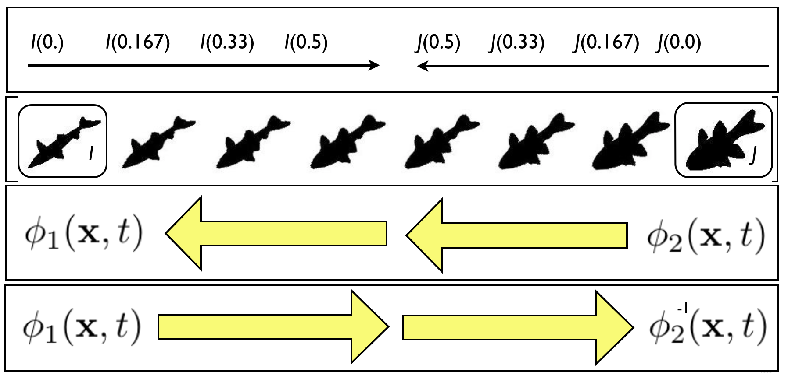


## Diffeomorphisms:  Occam's razor modeling


_differentiable map with differentiable inverse_

## Diffeomoprhisms:  fine-grained and flexible maps

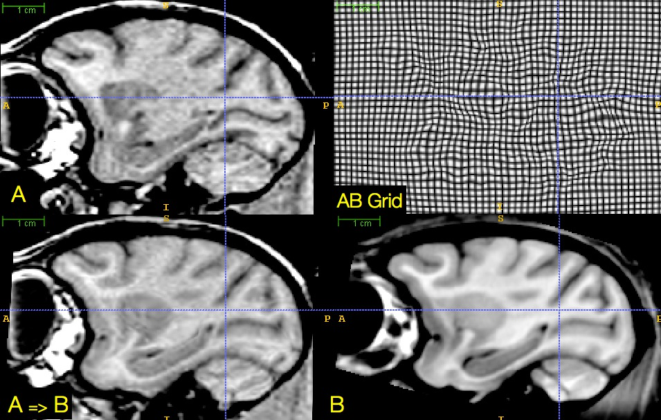

## Beyond original SyN

\small

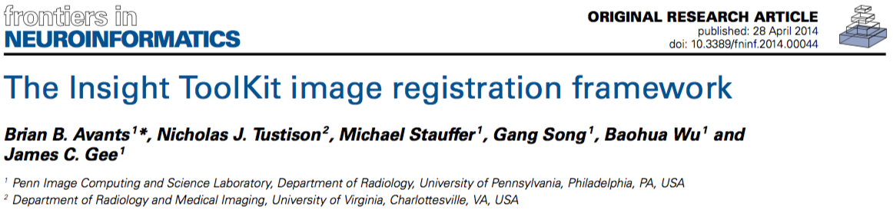

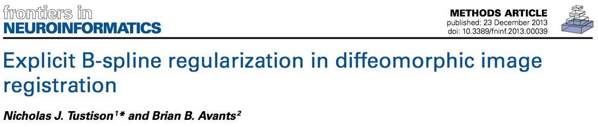

## ```antsRegistration```
<BR><BR>

```bash
$ antsRegistration -h

COMMAND:
     antsRegistration

OPTIONS:
     --version
     -d, --dimensionality 2/3
     -o, --output outputTransformPrefix
                  [outputTransformPrefix,<outputWarpedImage>,<outputInverseWarpedImage>]
     -j, --save-state saveSateAsTransform
     -k, --restore-state restoreStateAsATransform
     -a, --write-composite-transform 1/(0)
     -p, --print-similarity-measure-interval <unsignedIntegerValue>
     --write-interval-volumes <unsignedIntegerValue>
     -z, --collapse-output-transforms (1)/0
     -i, --initialize-transforms-per-stage (1)/0
     -n, --interpolation Linear
                         NearestNeighbor
                         MultiLabel[<sigma=imageSpacing>,<alpha=4.0>]
                         Gaussian[<sigma=imageSpacing>,<alpha=1.0>]
                         BSpline[<order=3>]
                         CosineWindowedSinc
                         WelchWindowedSinc
                         HammingWindowedSinc
                         LanczosWindowedSinc
     -g, --restrict-deformation PxQxR
     -q, --initial-fixed-transform initialTransform
                                   [initialTransform,<useInverse>]
                                   [fixedImage,movingImage,initializationFeature]
     -r, --initial-moving-transform initialTransform
                                    [initialTransform,<useInverse>]
                                    [fixedImage,movingImage,initializationFeature]
     -m, --metric CC[fixedImage,movingImage,metricWeight,radius,<samplingStrategy={None,Regular,Random}>,<samplingPercentage=[0,1]>]
                  MI[fixedImage,movingImage,metricWeight,numberOfBins,<samplingStrategy={None,Regular,Random}>,<samplingPercentage=[0,1]>]
                  Mattes[fixedImage,movingImage,metricWeight,numberOfBins,<samplingStrategy={None,Regular,Random}>,<samplingPercentage=[0,1]>]
                  MeanSquares[fixedImage,movingImage,metricWeight,radius=NA,<samplingStrategy={None,Regular,Random}>,<samplingPercentage=[0,1]>]
                  Demons[fixedImage,movingImage,metricWeight,radius=NA,<samplingStrategy={None,Regular,Random}>,<samplingPercentage=[0,1]>]
                  GC[fixedImage,movingImage,metricWeight,radius=NA,<samplingStrategy={None,Regular,Random}>,<samplingPercentage=[0,1]>]
                  ICP[fixedPointSet,movingPointSet,metricWeight,<samplingPercentage=[0,1]>,<boundaryPointsOnly=0>]
                  PSE[fixedPointSet,movingPointSet,metricWeight,<samplingPercentage=[0,1]>,<boundaryPointsOnly=0>,<pointSetSigma=1>,<kNeighborhood=50>]
                  JHCT[fixedPointSet,movingPointSet,metricWeight,<samplingPercentage=[0,1]>,<boundaryPointsOnly=0>,<pointSetSigma=1>,<kNeighborhood=50>,<alpha=1.1>,<useAnisotropicCovariances=1>]
                  IGDM[fixedImage,movingImage,metricWeight,fixedMask,movingMask,<neighborhoodRadius=0x0>,<intensitySigma=0>,<distanceSigma=0>,<kNeighborhood=1>,<gradientSigma=1>]
     -t, --transform Rigid[gradientStep]
                     Affine[gradientStep]
                     CompositeAffine[gradientStep]
                     Similarity[gradientStep]
                     Translation[gradientStep]
                     BSpline[gradientStep,meshSizeAtBaseLevel]
                     GaussianDisplacementField[gradientStep,updateFieldVarianceInVoxelSpace,totalFieldVarianceInVoxelSpace]
                     BSplineDisplacementField[gradientStep,updateFieldMeshSizeAtBaseLevel,totalFieldMeshSizeAtBaseLevel,<splineOrder=3>]
                     TimeVaryingVelocityField[gradientStep,numberOfTimeIndices,updateFieldVarianceInVoxelSpace,updateFieldTimeVariance,totalFieldVarianceInVoxelSpace,totalFieldTimeVariance]
                     TimeVaryingBSplineVelocityField[gradientStep,velocityFieldMeshSize,<numberOfTimePointSamples=4>,<splineOrder=3>]
                     SyN[gradientStep,updateFieldVarianceInVoxelSpace,totalFieldVarianceInVoxelSpace]
                     BSplineSyN[gradientStep,updateFieldMeshSizeAtBaseLevel,totalFieldMeshSizeAtBaseLevel,<splineOrder=3>]
                     Exponential[gradientStep,updateFieldVarianceInVoxelSpace,velocityFieldVarianceInVoxelSpace,<numberOfIntegrationSteps>]
                     BSplineExponential[gradientStep,updateFieldMeshSizeAtBaseLevel,velocityFieldMeshSizeAtBaseLevel,<numberOfIntegrationSteps>,<splineOrder=3>]
     -c, --convergence MxNxO
                       [MxNxO,<convergenceThreshold=1e-6>,<convergenceWindowSize=10>]
     -s, --smoothing-sigmas MxNxO...
     -f, --shrink-factors MxNxO...
     -u, --use-histogram-matching
     -l, --use-estimate-learning-rate-once
     -w, --winsorize-image-intensities [lowerQuantile,upperQuantile]
     -x, --masks [fixedImageMask,movingImageMask]
     --float
     --minc
     -v, --verbose (0)/1
     -h
     --help
```

## Template building:  creating the average Joe

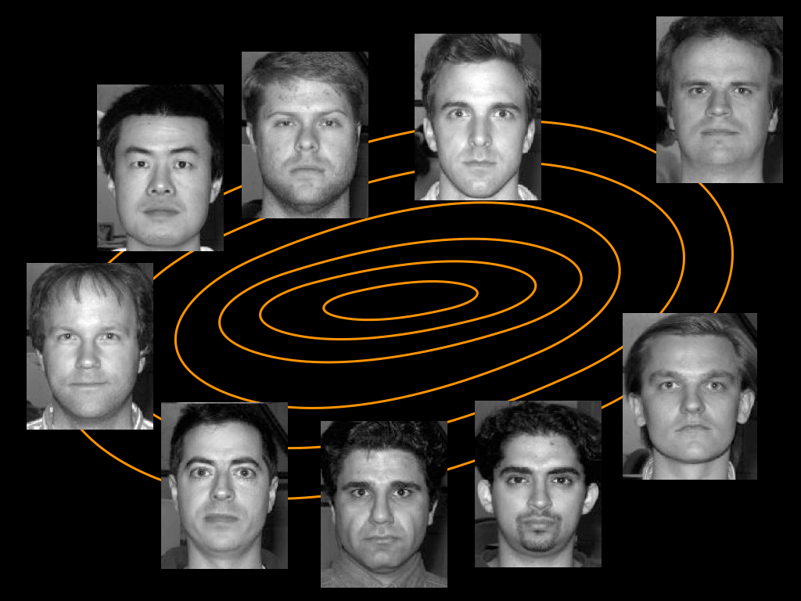

## "Attractiveness" $\rightarrow$ mental processing?

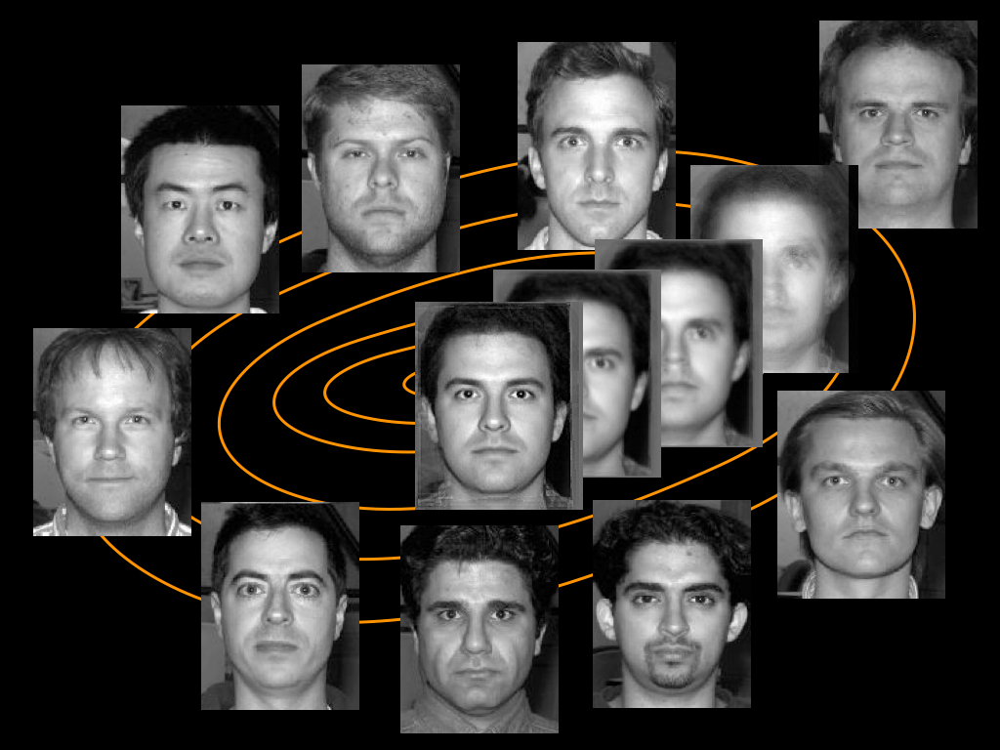

##  What about brains?

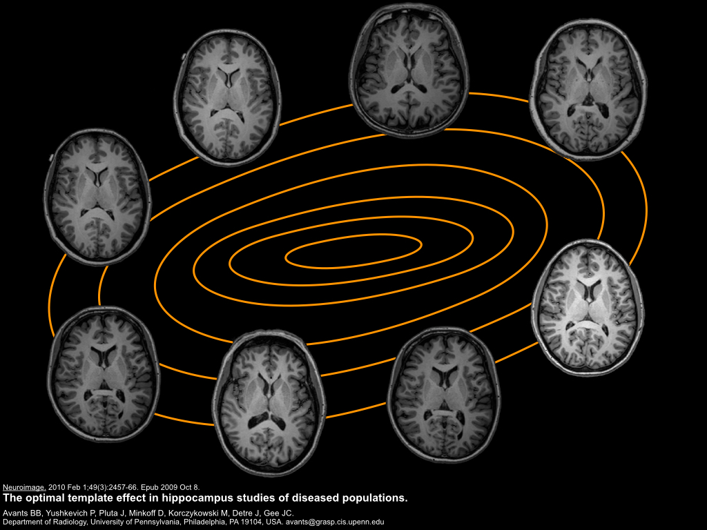

## Templates facilitate computation

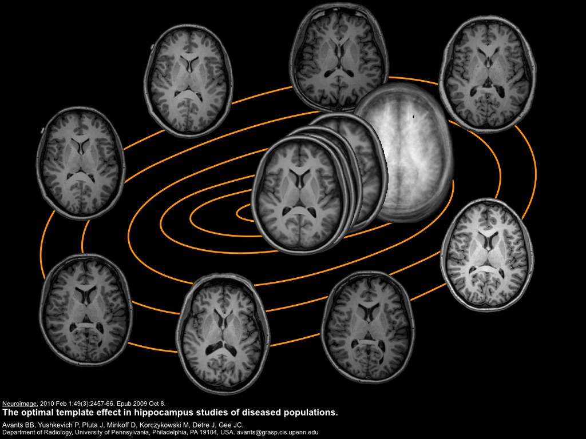

## Gender discernibility?

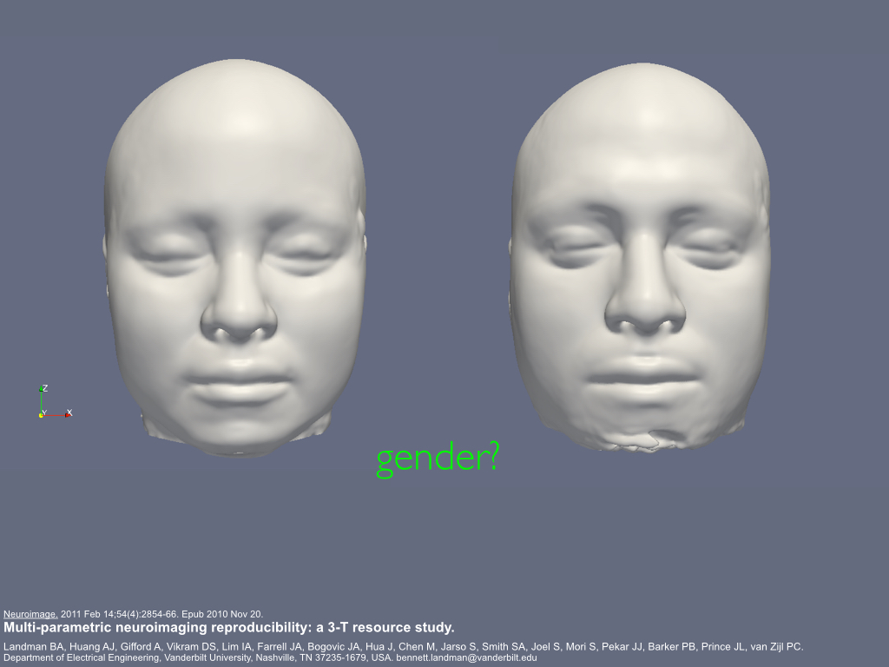

## ```antsMultivariateTemplateConstruction2.sh```

```bash
$ antsMultivariateTemplateConstruction2.sh

Usage:

antsMultivariateTemplateConstruction2.sh -d ImageDimension -o OutputPrefix <other options> <images>

Compulsory arguments (minimal command line requires SGE/PBS cluster, otherwise use -c and
  -j options):

     -d:  ImageDimension: 2 or 3 (for 2 or 3 dimensional registration of single volume)
   ImageDimension: 4 (for template generation of time-series data)

     -o:  OutputPrefix; A prefix that is prepended to all output files.

<images>  List of images in the current directory, eg *_t1.nii.gz. Should be at the end
          of the command.  Optionally, one can specify a .csv or .txt file where each
          line is the location of the input image.  One can also specify more than
          one file for each image for multi-modal template construction (e.g. t1 and t2).
          For the multi-modal case, the templates will be consecutively numbered (e.g.
          template0.nii.gz, template1.nii.gz, ...).

NB: All images to be added to the template should be in the same directory, and this
    script should be invoked from that directory.

Optional arguments:

     -a   image statistic used to summarize images (default 1)
          0 = mean
          1 = mean of normalized intensities
          2 = median

     -b:  Backup images and results from all iterations (default = 0):  Boolean to save
          the transform files, bias corrected, and warped images for each iteration.

     -c:  Control for parallel computation (default 0):
          0 = run serially
          1 = SGE qsub
          2 = use PEXEC (localhost)
          3 = Apple XGrid
          4 = PBS qsub

     -e   use single precision ( default 1 )

     -g:  Gradient step size (default 0.25): smaller in magnitude results in more
          cautious steps.

     -i:  Iteration limit (default 4): iterations of the template construction
          (Iteration limit)*NumImages registrations.

     -j:  Number of cpu cores to use locally for pexec option (default 2; requires "-c 2")

     -k:  Number of modalities used to construct the template (default 1):  For example,
          if one wanted to create a multimodal template consisting of T1,T2,and FA
          components ("-k 3").

     -w:  Modality weights used in the similarity metric (default = 1): specified as
          e.g. 1x0.5x0.75.

     -q:  Max iterations for each pairwise registration (default = 100x100x70x20):
          specified in the form ...xJxKxL where
            J = max iterations at coarsest resolution (here, reduced by power of 2^2)
            K = middle resolution iterations (here, reduced by power of 2)
            L = fine resolution iteratioxns (here, full resolution).
          Finer resolutions take much more time per iteration than coarser resolutions.

     -f:  Shrink factors (default = 6x4x2x1):  Also in the same form as -q max iterations.
          Needs to have the same number of components.

     -s:  Smoothing factors (default = 3x2x1x0):  Also in the same form as -q max
          iterations.  Needs to have the same number of components.

     -n:  N4BiasFieldCorrection of moving image: 0 == off, 1 == on (default 1).

     -p:  Commands to prepend to job scripts (e.g., change into appropriate directory, set
          paths, etc)

     -r:  Do rigid-body registration of inputs before creating template (default 0):
          0 == off 1 == on. Only useful when you do not have an initial template

     -l:  Use linear image registration stages during the pairwise (template/subject)
          deformable registration.  Otherwise, registration is limited to SyN or
          B-spline SyN (see '-t' option).  This is '1' by default.

     -m:  Type of similarity metric used for registration (default = CC):  Options are
            CC = cross-correlation
            MI = mutual information
            MSQ = mean square difference
            DEMONS = demon's metric
          A similarity metric per modality can be specified.  If the CC metric is chosen,
          one can also specify the radius in brackets, e.g. '-m CC[4]'.

     -t:  Type of transformation model used for registration (default = SyN):  Options are
            SyN = Greedy SyN
            BSplineSyN = Greedy B-spline SyN
            TimeVaryingVelocityField = Time-varying velocity field
            TimeVaryingBSplineVelocityField = Time-varying B-spline velocity field

     -u:  Walltime (default = 20:00:00):  Option for PBS qsub specifying requested time
          per pairwise registration.

     -v:  Memory limit (default = 8gb):  Option for PBS qsub specifying requested memory
          per pairwise registration.

     -x:  XGrid arguments (e.g., -x "-p password -h controlhost")

     -y:  Update the template with the full affine transform (default 1). If 0, the rigid
          component of the affine transform will not be used to update the template. If your
          template drifts in translation or orientation try -y 0.

     -z:  Use this this volume as the target of all inputs. When not used, the script
          will create an unbiased starting point by averaging all inputs. Use the full
          path.
          For multiple modalities, specify -z modality1.nii.gz -z modality2.nii.gz ...
          in the same modality order as the input images.

Example:

antsMultivariateTemplateConstruction2.sh -d 3 -i 3 -k 1 -f 4x2x1 -s 2x1x0vox -q 30x20x4 -t SyN  -m CC -c 0 -o MY sub*avg.nii.gz

Multimodal example:

antsMultivariateTemplateConstruction2.sh -d 3 -i 3 -k 2 -f 4x2x1 -s 2x1x0vox -q 30x20x4 -t SyN -z t1.nii.gz -z t2.nii.gz  -m CC -c 0 -o MY templateInput.csv

where templateInput.csv contains

subjectA_t1.nii.gz,subjectA_t2.nii.gz
subjectB_t1.nii.gz,subjectB_t2.nii.gz
...

--------------------------------------------------------------------------------------
ANTS was created by:
--------------------------------------------------------------------------------------
Brian B. Avants, Nick Tustison and Gang Song
Penn Image Computing And Science Laboratory
University of Pennsylvania

Please reference http://www.ncbi.nlm.nih.gov/pubmed/20851191 when employing this script
in your studies. A reproducible evaluation of ANTs similarity metric performance in
brain image registration:

* Avants BB, Tustison NJ, Song G, Cook PA, Klein A, Gee JC. Neuroimage, 2011.

Also see http://www.ncbi.nlm.nih.gov/pubmed/19818860 for more details.

The script has been updated and improved since this publication.

--------------------------------------------------------------------------------------
Script by Nick Tustison
--------------------------------------------------------------------------------------
Apple XGrid support by Craig Stark
--------------------------------------------------------------------------------------
```


<!-----------------  Atropos -------------------------->

## Bayesian segmentation with spatial/MRF priors

## "20+ years of development.  <br>_Show me the code!_"

<p align = "right"><small>Brian Avants, MICCAI workshop</small></p>

## Atropos

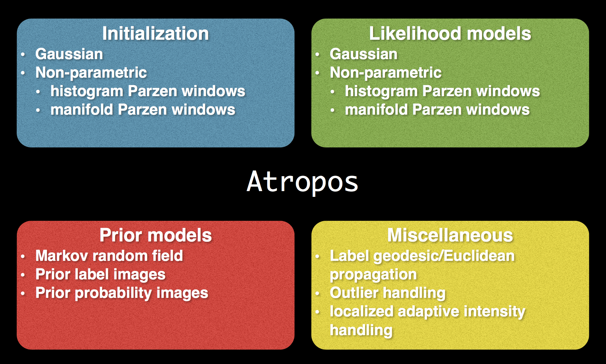

## Algorithmic workflow<br>(Atropos + N4)

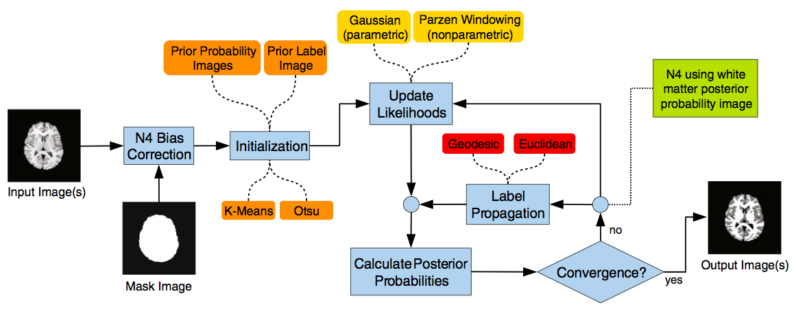


## Sample results from public data

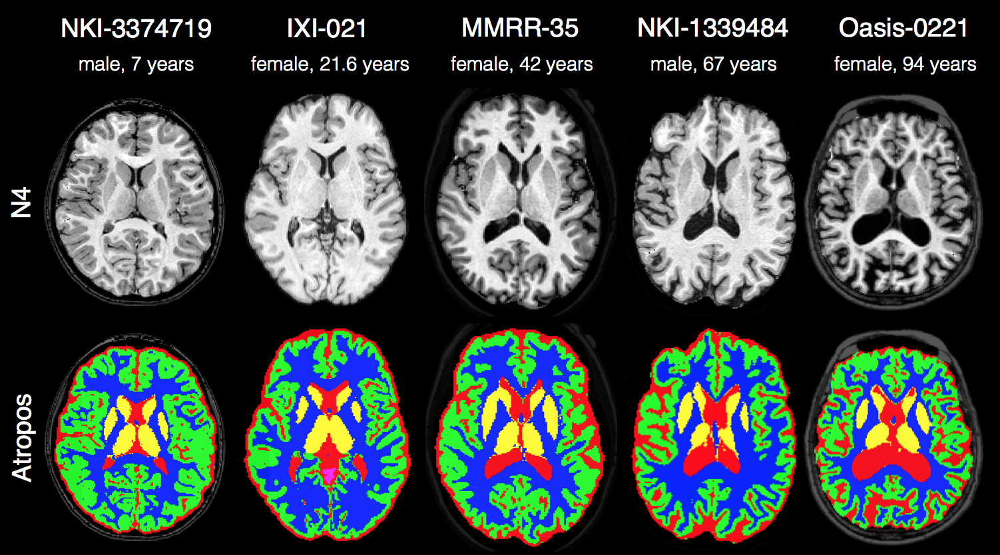

## Command line help

<font size="5", color="lightgrey">
```
$ Atropos -h

COMMAND:
     Atropos

OPTIONS:
     -d, --image-dimensionality 2/3/4
     -a, --intensity-image [intensityImage,<adaptiveSmoothingWeight>]
     -b, --bspline [<numberOfLevels=6>,<initialMeshResolution=1x1x...>,<splineOrder=3>]
     -i, --initialization Random[numberOfClasses]
                          Otsu[numberOfTissueClasses]
                          KMeans[numberOfTissueClasses,<clusterCenters(in ascending order and for first intensity image only)>]
                          PriorProbabilityImages[numberOfTissueClasses,fileSeriesFormat(index=1 to numberOfClasses) or vectorImage,priorWeighting,<priorProbabilityThreshold>]
                          PriorLabelImage[numberOfTissueClasses,labelImage,priorWeighting]
     -s, --partial-volume-label-set label1xlabel2xlabel3
     --use-partial-volume-likelihoods 1/(0)
                                      true/(false)
     -p, --posterior-formulation Socrates[<useMixtureModelProportions=1>,<initialAnnealingTemperature=1>,<annealingRate=1>,<minimumTemperature=0.1>]
                                 Plato[<useMixtureModelProportions=1>,<initialAnnealingTemperature=1>,<annealingRate=1>,<minimumTemperature=0.1>]
                                 Aristotle[<useMixtureModelProportions=1>,<initialAnnealingTemperature=1>,<annealingRate=1>,<minimumTemperature=0.1>]
                                 Sigmoid[<useMixtureModelProportions=1>,<initialAnnealingTemperature=1>,<annealingRate=1>,<minimumTemperature=0.1>]]
     -x, --mask-image maskImageFilename
     -c, --convergence [<numberOfIterations=5>,<convergenceThreshold=0.001>]
     -k, --likelihood-model Gaussian
                            HistogramParzenWindows[<sigma=1.0>,<numberOfBins=32>]
                            ManifoldParzenWindows[<pointSetSigma=1.0>,<evaluationKNeighborhood=50>,<CovarianceKNeighborhood=0>,<kernelSigma=0>]
                            JointShapeAndOrientationProbability[<shapeSigma=1.0>,<numberOfShapeBins=64>, <orientationSigma=1.0>, <numberOfOrientationBins=32>]
                            LogEuclideanGaussian
     -m, --mrf [<smoothingFactor=0.3>,<radius=1x1x...>]
               [<mrfCoefficientImage>,<radius=1x1x...>]
     -g, --icm [<useAsynchronousUpdate=1>,<maximumNumberOfICMIterations=1>,<icmCodeImage=''>]
     -r, --use-random-seed 0/(1)
     -o, --output [classifiedImage,<posteriorProbabilityImageFileNameFormat>]
     -u, --minimize-memory-usage (0)/1
     -w, --winsorize-outliers BoxPlot[<lowerPercentile=0.25>,<upperPercentile=0.75>,<whiskerLength=1.5>]
                              GrubbsRosner[<significanceLevel=0.05>,<winsorizingLevel=0.10>]
     -e, --use-euclidean-distance (0)/1
     -l, --label-propagation whichLabel[lambda=0.0,<boundaryProbability=1.0>]
     -h
     --help
```
</font>


<!-----------------  N4 -------------------------->

## N4 bias correction

## Nonparametric nonuniform intensity normalization (N3)

* Developed at the Montreal Neurological Institute (John Sled, 1998)

* Part of the standard preprocessing protocol in large scale projects such as ADNI

* The traditional de facto standard in MRI bias correction
    + good performance
    + *public availability*

* Public availability --- set of perl scripts coordinating various C++ programs

* "*Let's incorporate N3 into ANTs!*"

## N3 adoption issues

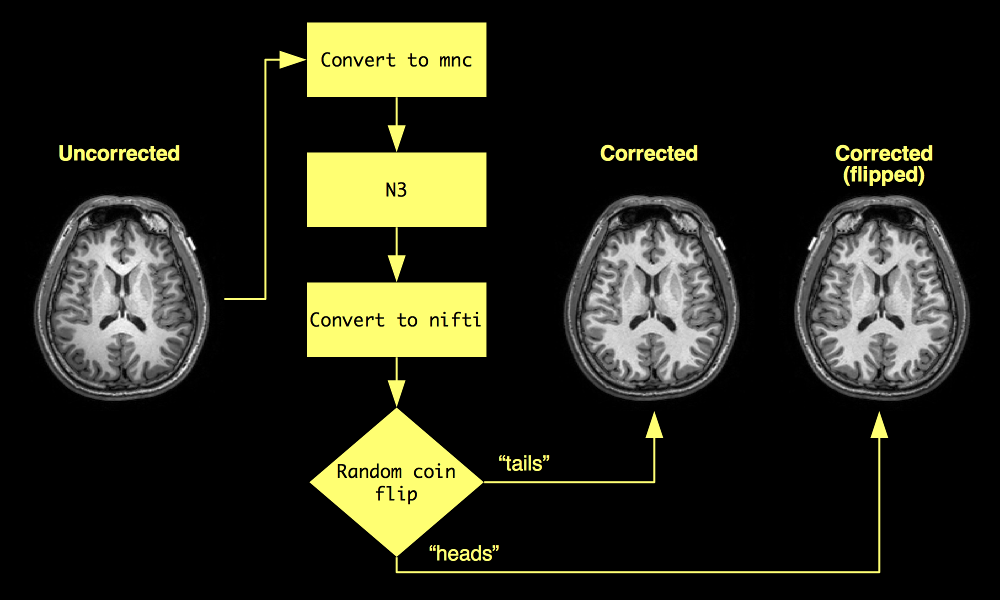

"*So let's re-implement N3 in ITK for ANTs users.*"

## N3 -> N4<sup>*</sup>

<p align = "middle"><small><sup>*</sup><u>N</u>ick's N3</small></p>

* comparative [evaluation](http://www.ncbi.nlm.nih.gov/pubmed/20378467)

* smaller spline distances (useful for higher magnet strengths)

* multiresolution

* weighted regional mask (used in [`antsAtroposN4.sh`](https://github.com/stnava/ANTs/blob/master/Scripts/antsAtroposN4.sh))

* faster execution times

* less susceptible to noise

* _publicly available_


## N4 example

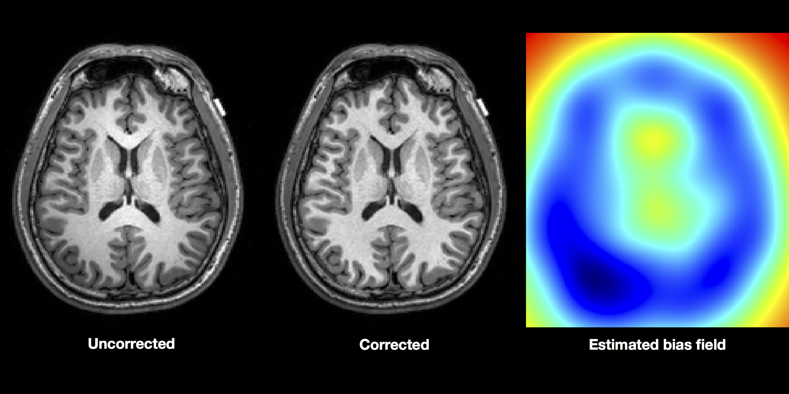

## Command line help

<font size="5", color="lightgrey">
```
$ N4BiasFieldCorrection -h

COMMAND:
     N4BiasFieldCorrection

OPTIONS:
     -d, --image-dimensionality 2/3/4
     -i, --input-image inputImageFilename
     -x, --mask-image maskImageFilename
     -r, --rescale-intensities 0/(1)
     -w, --weight-image weightImageFilename
     -s, --shrink-factor 1/2/3/4/...
     -c, --convergence [<numberOfIterations=50x50x50x50>,<convergenceThreshold=0.0>]
     -b, --bspline-fitting [splineDistance,<splineOrder=3>]
                           [initialMeshResolution,<splineOrder=3>]
     -t, --histogram-sharpening [<FWHM=0.15>,<wienerNoise=0.01>,<numberOfHistogramBins=200>]
     -o, --output correctedImage
                  [correctedImage,<biasField>]
     -h
     --help
```
</font>

<!-----------------  JLF -------------------------->


## Joint label fusion

## Multi-atlas labeling

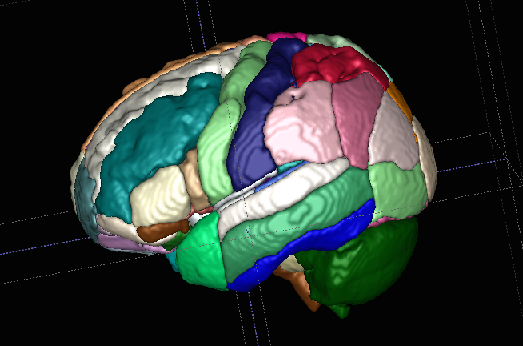

## Multi-atlas segmentation

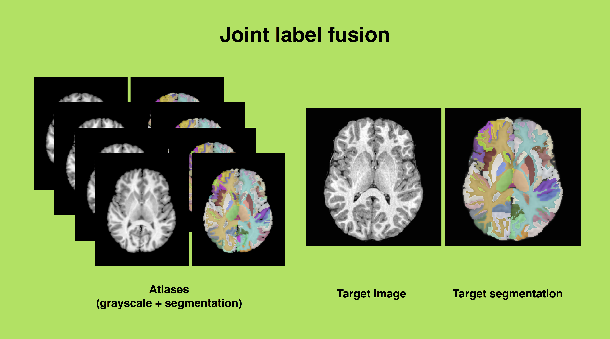

## Multi-atlas 2012 results

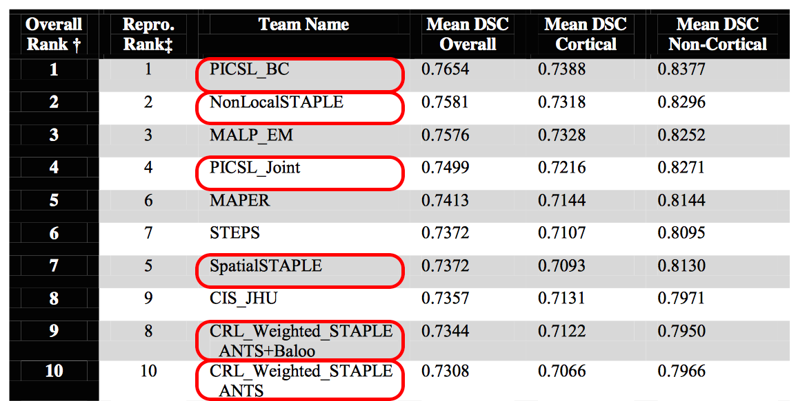

## New work:  joint intensity fusion

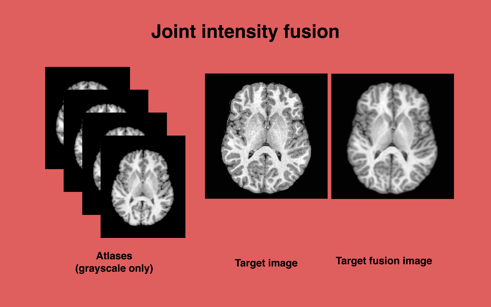

## Command line help

<font size="5", color="lightgrey">
```
$ antsJointFusion -h

COMMAND:
     antsJointFusion

OPTIONS:
     -d, --image-dimensionality 2/3/4
     -t, --target-image targetImage
                        [targetImageModality0,targetImageModality1,...,targetImageModalityN]
     -g, --atlas-image atlasImage
                       [atlasImageModality0,atlasImageModality1,...,atlasImageModalityN]
     -l, --atlas-segmentation atlasSegmentation
     -a, --alpha 0.1
     -b, --beta 2.0
     -r, --retain-label-posterior-images (0)/1
     -f, --retain-atlas-voting-images (0)/1
     -c, --constrain-nonnegative (0)/1
     -p, --patch-radius 2
                        2x2x2
     -m, --patch-metric (PC)/MSQ
     -s, --search-radius 3
                         3x3x3
     -e, --exclusion-image label[exclusionImage]
     -x, --mask-image maskImageFilename
     -o, --output labelFusionImage
                  intensityFusionImageFileNameFormat
                  [labelFusionImage,intensityFusionImageFileNameFormat,<labelPosteriorProbabilityImageFileNameFormat>,<atlasVotingWeightImageFileNameFormat>]
     --version
     -v, --verbose (0)/1
     -h
     --help
```
</font>


## Spatially adaptive denoising

## Command line help

<font size="5", color="lightgrey">
```
$ DenoiseImage -h

COMMAND:
     DenoiseImage

OPTIONS:
     -d, --image-dimensionality 2/3/4
     -i, --input-image inputImageFilename
     -n, --noise-model Rician/(Gaussian)
     -s, --shrink-factor (1)/2/3/...
     -o, --output correctedImage
                  [correctedImage,<noiseImage>]
     --version
     -v, --verbose (0)/1
     -h
     --help
```
</font>

