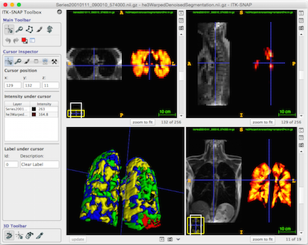

---
output:
  pdf_document:
    fig_caption: true
    latex_engine: xelatex
    keep_tex: yes
header-includes:
   - \usepackage{booktabs}
   - \usepackage[font={small},labelfont=bf,labelsep=colon]{caption}
   - \linespread{0.85}
   - \usepackage[compact]{titlesec}
   - \usepackage{enumitem}
   - \usepackage{tikz}
   - \def\checkmark{\tikz\fill[scale=0.4](0,.35) -- (.25,0) -- (1,.7) -- (.25,.15) -- cycle;}
   - \setlist{nolistsep}
   - \titlespacing{\section}{2pt}{*0}{*0}
   - \titlespacing{\subsection}{2pt}{*0}{*0}
   - \titlespacing{\subsubsection}{2pt}{*0}{*0}
   - \setlength{\parskip}{3pt}
bibliography: references.bib
csl: national-science-foundation-grant-proposals.csl
fontsize: 11pt
mainfont: Georgia
geometry: margin=0.5in
---

<!--
   - \setlength{\parskip}{3pt}
   - \setlength{\topsep}{0pt}
   - \setlength{\partopsep}{0pt}
   - \setlength{\itemsep}{0pt}
   - \setlength{\floatsep}{0pt}
   - \setlength{\intextsep}{2pt}
   - \setlength{\abovecaptionskip}{2pt}
   - \setlength{\belowcaptionskip}{0pt}
-->


<style type="text/css">
body,
code.bash{
  font-size: 8px;
}
pre {
  font-size: 8px
}
</style>

<!-- https://grants.nih.gov/grants/ElectronicReceipt/pdf_guidelines.htm -->


```{r setup, include=FALSE}
knitr::opts_chunk$set( cache=TRUE )
```

\pagenumbering{gobble}
\begin{center}
{\Large \bf ITK-Lung:  A Software Framework for Lung Image Processing and Analysis}
\end{center}

# 2 Specific Aims

<!--
The development and proliferation of quantitative image analysis methods have accelerated
research efforts and are having an increasingly significant impact in modern clinical
practice.  Although the research utility of these techniques has been amply demonstrated in
determining longitudinal and groupwise trends, they are also becoming increasingly relevant
in the clinical setting in providing biomarkers for aiding patient diagnoses, monitoring
disease progression, and determining treatment outcomes.  Increases in the capabilities
and accessibility of computational facilities and a corresponding sophistication in computational
algorithms have only made such practices more commonplace.
-->

One of the most significant hurdles to \textcolor{red}{leveraging imaging innovations}
in adopting more quantitative clinical practices and
exploring additional novel research pathways is the availability of accurate, robust, and
easy-to-use image analysis tools.
Historically, the research and clinical communities (and their overlap)
have significantly benefited from computational image
analysis packages, particularly those softwares which have been tailored for
specific application domains.  Although several such established packages exist for
neuroimaging research (e.g., FSL, FreeSurfer, AFNI, SPM), _no such \textcolor{red}{general}
package exists for
pulmonary imaging analysis.  The primary goal of this project is to develop
a robust, open-source image analysis toolkit and dissemination platform
specifically targeted at the pulmonary research community.
\textcolor{red}{Given the signifcant efforts
to make lung imaging datasets publicly available (such as LIDC, RIDER, COPDGene,
and IELCAP), this contribution would be innovative as it would meet a critical
need through a first-of-its-kind software package for multi-modality lung image analysis.}_


Although methodological research is continually being presented at conferences and
published in various venues, the unfortunate reality is that much of this work exists
strictly in "advertisement" form.  Oftentimes the underlying code is unavailable to other
researchers or is implemented in a limited manner (i.e., strictly as proof-of-concept
software).  Frequently, crucial parameter choices are omitted in the corresponding
publication(s) which makes external implementations difficult.  In addition, the data used
to showcase the proposed methodologies is often limited to carefully selected snapshots
for publication purposes which might not be representative of algorithmic performance.
Finally, many of these analysis methods are patented and/or integrated into proprietary
commercial software packages which limits accessibility to researchers.

As a corrective alternative, this project brings together leading expertise in lung
imaging research at the \textcolor{red}{University of Pennsylvania (Penn)} and
\textcolor{red}{University of Virginia (UVa)} to develop, evaluate and deploy under community support
an open-source software toolkit
targeted for pulmonary imaging research.  As principal developers of the popular, open-source
ANTs, ITK-SNAP and ITK packages, we have extensive experience in the development of
well-written software and propose
to make a similar impact in the pulmonary
community with this project.  Specifically,
we plan to provide \textcolor{red}{core algorithms} for \textcolor{red}{specific} pulmonary
image analysis tasks across multiple modalities, many
of which we have \textcolor{red}{included with previous publications}.  These basic tasks
\textcolor{red}{include intra- and intermodal} pulmonary image registration,
template building for cross-sectional and longitudinal (i.e., respiratory cycle) analyses,
functional and structural lung image segmentation, \textcolor{red}{PET imaging},
\textcolor{red}{perfusion analysis}, and computation of quantitative image
indices as potential imaging biomarkers.  \textcolor{red}{These efforts would
facilitate other NIH-sponsored projects}
\textcolor{red}{
which interface specific pulmonary algorithms (e.g., CT nodule detection) with clinical
and research applications.}
In addition to the software, we will
provide scripts, documentation, and tutorial materials consistent with open-science
principles.   Formally, this project is defined by the following specific aims:

* __Specific Aim 1:__  __Develop ITK-Lung, a set of open-source software tools for CT, PET, proton, and He-3
pulmonary computational analysis.__  These open-source software tools
\textcolor{red}{based on selected algorithms}
will specifically target pulmonary image analysis and comprise core application functions such as
inspiratory/expiratory registration, ventilation-based segmentation,
lung and lobe estimation, airway and vessel segmentation, \textcolor{red}{PET imaging},
\textcolor{red}{perfusion analysis}, and calculation of clinical indices for
characterization of lung development and pathology.  \textcolor{red}{As a complement} to these software development
efforts, CT and 1H MRI multi-atlas libraries will be provided as open data, complete
with the corresponding lung, airway, vessel, and lobe segmentations according to modality
\textcolor{red}{to facilitate the employment of atlas-based algorithms on other data sets.}
In addition, we will generate optimal intensity/shape templates from each library
\textcolor{red}{for use as common
coordinate frameworks for more localized (i.e., voxelwise) analyses}.  Both
sets of data will be provided with the scripts used to produce them in order to permit
user-reproduction of the results.
As developers of several leading open-source applications for image segmentation and registration, we
know firsthand that the impact of a particular technological innovation greatly depends on the availability
of an easily accessible software implementation.  The proposed software framework will tie together all of
the capabilities of the project’s developed methodology in the form of programmable workflows and provide
a seamless user experience through a full featured graphical user interface.  Interactive functionality
will extend beyond the ability to steer segmentation and registration pipelines to include tools for
evaluation and visualization of processed results.
* __Specific Aim 2:__  __Validate and disseminate the developed ITK-Lung resources by leveraging use
cases from a broad network of partner investigators representing the state-of-the-science in
lung imaging research.__  \textcolor{red}{This aim will evaluate and refine the proposed framework within the real-world context of pulmonary research being carried out at Penn and UVa in addition to various partner sites serving as secondary beta testers.}
We will disseminate the results of the project through open-source
distribution of the software, atlases and documentation, online user support, and conduct of
hands-on training workshops.


\newpage

# 3 Research Strategy

## __3(a) Significance__

__3(a.1) The importance of image analysis tools for research and clinical investigation.__
The increased utilization of imaging for both research and clinical purposes has
furthered
the demand for quantitative image analysis techniques.  The use of these computational
techniques is motivated by the need for less subjectivity and more standardization in
medical image interpretation, increased speed and automation in diagnosis, and greater
robustness and accuracy for determining biological correlates with imaging findings.
For example, in the area of pharmaceutical development and testing, imaging biomarkers are crucial.
In order to determine fundamental study parameters such as drug safety
and effectiveness, quantitative assessments derived from imaging measures must be objective
and reproducible [@Wang:2010aa] which is often difficult without computational aid given the intra-
and inter-reader variability in radiological practice [@Zhao:2013aa;@McErlean:2013aa].
Additionally, the exciting possibilities associated with "big data" and the potential
for improvement in individualized, evidence-based medicine has also increased the need
for sophisticated data transformation and machine learning techniques.

__3(a.2) Open-source as an essential attribute of high-impact image analysis toolkits.__
Well-vetted and publicly available software
\textcolor{red}{have transformed targeted research fields}.
For example, the neuroscience community has greatly
benefited from highly evolved software packages such as FreeSurfer [@Fischl:2012aa], the FMRIB Software
Library (FSL) [@Jenkinson:2012aa], the Analysis of Functional NeuroImages (AFNI) package [@Cox:2012aa], the
Statistical Parametric Mapping (SPM) package [@Ashburner:2012aa], and several others.

<!--
Performing a pubmed query for any one of
these softwares every year for the past decade (cf Figure 1) illustrates the growing use of
such packages and the research studies that are produced as a result.

```{r pubmedQuery, include=TRUE, echo=FALSE, warning=FALSE, message=FALSE, results="hide", fig.height=2, fig.width=6, fig.cap="Number of articles per year which cite publicly available neuroimaging analysis packages (specifically, FreeSurfer, AFNI, FSL, and SPM).  Although the benefits seem clear for the neuroscience community, analogous efforts within the pulmonary community have yet to be undertaken despite consensus amongst researchers and clinicians regarding the utility of such offerings." }
years <- 2005:2014

numberOfAbstractsPerYear <- rep( 0, length( years ) )
for( i in 1:length( years ) )
  {
  cat( "Doing year", years[i], "\n" )
  query = "afni OR fsl OR freesurfer OR (statistical AND parametric AND mapping)"
  res <- EUtilsSummary( query, db = "pubmed", retmax = 5000, mindate = as.character( years[i] ), maxdate = as.character( years[i] ) )
  summary( res )
  fetch <- EUtilsGet( res )
  abstracts <- AbstractText( fetch )
  numberOfAbstractsPerYear[i] <- length( abstracts )
  }

plotDataFrame <- data.frame( Year = as.factor( years ), NumberOfAbstracts = numberOfAbstractsPerYear )
ggplot( data = plotDataFrame, aes( x = Year, y = NumberOfAbstracts, fill = NumberOfAbstracts ) ) +
          geom_bar( stat = "identity" ) +
          scale_fill_gradient( low = "#01256e", high = "#6d0e0e" ) +
          ylab( "Number of articles" ) +
          xlab( "Publication year" ) +
          theme( legend.position = "none" )
```
-->


_\textcolor{red}{However, despite the important implications for the pulmonary imaging
community}, no such analogous set of tools exist for multi-modal pulmonary-specific research.
\textcolor{red}{Such an original software package would potentially have an immediate and
significant impact.}_  Indeed, in a recent
review of CT- and MRI-derived biomarkers for pulmonary clinical investigation, the authorial
consensus is that ``_[the absence of] universally available image analysis software'' is a major hinderance
to more widespread usage of such imaging biomarkers_ [@Hoffman:2015aa].

Medical image analysis libraries (e.g., the NIH-sponsored Insight ToolKit) provide extensive
algorithmic
capabilities for a range of generic image processing tasks.  However,
tailored software packages for certain application domains (e.g., lung image analysis)
\textcolor{red}{do not exist}
 despite the vast number of algorithms that have been proposed in the literature
\textcolor{red}{(most of which are not available to the public)}.[^1]
\textcolor{red}{Importantly}, the goals of this project would
significantly support the National Library of Medicine’s (NLM)
open-source directives in that
all software proposed in the project would be developed using the established Insight ToolKit’s coding and testing
standards with the specific objective that all project code would be contributed
for inclusion in future versions of the Insight ToolKit (ITK) as we have done in the past.
\textcolor{red}{NLM's position on open-source stems from the} documented benefits
within the targeted communities for which the \textcolor{red}{software} is developed and supported.  In addition to
the increase in research output illustrated earlier, open-source permits
\textcolor{red}{trainees} and
researchers to learn specific computational techniques in a social environment [@Yunwen:2003aa].
This, in turn, provides motivation for user-based support including potential contributions
such as bug fixes and feature additions.  Additional analyses have shown the tremendous
cost savings that open-source software yields [@Rothwell:2008aa].  Furthermore,
 open-source development and distribution within a large, and well-invested
community (such as ITK) takes advantage of Linus's law, i.e., "given enough eyeballs, all bugs are
shallow," for producing robust software.

[^1]: \textcolor{red}{Several competitions have been held in recent years focused on the processing and
analysis of lung image data (e.g., VOLCANO09---nodule detection, EMPIRE10---registration and motion estimation,
LOLA11---lung and lobe segmentation, and VESSEL12---vasculature segmentation).  To the best of our knowledge, the vast majority of
the proposed algorithms are not publicly available.  Other pulmonary imaging efforts, such as LIDC
and RIDER, have amassed large amounts of imaging data but available software support is limited to organizational
tasks specific to those databases.}


## __3(b) Innovation__

__3(b.1) Open-source pulmonary imaging algorithmic innovation.__
Given the lack of open-source solutions for multi-modality pulmonary image analysis,
this project would produce the first-of-its-kind processing and analytic  platform for performing
such research.
Similar to the brain-specific algorithms provided in our ANTs
\textcolor{red}{(Advanced Normalization Tools)} toolkit [@ANTsWebsite], our
 project would include \textcolor{red}{several} essential algorithms for analyzing lung
images from different modalities, including CT, PET, 3He, and 1H MRI.
_A large number of algorithms have been proposed in various technical venues,
\textcolor{red}{but these are mostly in the form of
textual descriptions without accompanying software.}
\textcolor{red}{In contrast, we will provide} well-vetted and easy-to-use
implementations of specific robust methodologies
for pulmonary image analysis, many of which have been developed by our group._
To facilitate the usage of these algorithms, we will provide documentation including
self-contained online examples, tutorials, and hands-on training workshops.
\textcolor{red}{We recognize that the methodological depth of the field is extensive
and implementing even a small portion of the total number of algorithms would be
prohibitive.}  \textcolor{red}{However, the algorithmic implementations provided through this
project have been discussed in the literature and have delivered consistently
excellent performance in our
clinical collaborations.  The availability of such implementations will offer a
unique clinical utility to the community as well as a performance benchmark
and baseline platform for future
algorithm developers.}

__3(b.2) Use case studies with leading pulmonary research scientists.__
\textcolor{red}{Another} innovative component of the project is the inclusion of
\textcolor{red}{an} extensive \textcolor{red}{set of} use
cases from leading pulmonary \textcolor{red}{research groups with regression testing performed} using different
image acquisition protocols, equipment, etc. to ensure quality and robustness of the
\textcolor{red}{software and} processed data.
\textcolor{red}{The use of separate, independent testing sites will increase the value of the
tools produced by ensuring that their success is not specific to the particular
source of data.  This will increase the generality of the developed resources and
thus ease dissemination to the wider community. Toward this end, the}
real-world use cases were solicited representing as broadly as
possible the requirements of the community as well as
the multiple modality and algorithmic variations which commonly occur.
\textcolor{red}{Tutorial materials, data, and example scripts} drawn from
these \textcolor{red}{studies} will be provided to the public for any interested researcher to
apply to their own data.
Any clinical findings
of interest will be published in traditional venues (e.g., Chest).  In addition, we will
provide all the quantitative analysis scripts as a companion release for the paper
(e.g., see previous similar offerings from our group [@Tustison:2013ac;@Tustison:2014ab]).
\textcolor{red}{A clinically-based evaluation of these tools will provide insight into the specifics
of certain pulmonary pathologies
and also offer a reproducible mechanism for using the tools created in this project.}


## __3(c) Research design__

### 3(c.1) Preliminary data

\textcolor{red}{Major progress toward the proposed platform, demonstrating
project feasibility, has already been reported by our group (cf Table 1).
These publications not only document methodological novelty of the work but
also describe their subsequent usage for clinical research studies of small
to large cohorts.  Much of this innovation has been encoded in prototypical
form in the ANTs processing toolkit, as described below, to allow for continued
use, potential future improvements, and reproducibility.}

\input{papers_table.tex}

<!--
* __\textcolor{red}{spatial normalization}__: [@Gee:2003aa;@Sundaram:2005aa;@Cook:2007aa;@Tustison:2010aa;@Tustison:2011ab;@Tustison:2011ad;@Tustison:2012aa;@Tustison:2014ab]
* __\textcolor{red}{template generation}__: [@Tustison:2013ad]
* __\textcolor{red}{lung segmentation}__: [@Tustison:2011ad;@Barbosa:2011aa;@Qing:2014aa;@Qing:2014ab;@Tustison:2016aa]
* __\textcolor{red}{lobe segmentation}__: [@Qing:2014ab;@Tustison:2016aa]
* __\textcolor{red}{airway segmentation}__: [@Song:2010aa]
* __\textcolor{red}{functional segmentation}__: [@Tustison:2011aa;@Tustison:2013ad;@Teague:2014aa]
* __\textcolor{red}{feature indices}__: [@Tustison:2010ab;@Barbosa:2011aa;@Song:2012aa]
-->

__3(c.1.1) Generic ANTs core tools for image analysis and processing.__
The Advanced Normalization Tools (ANTs) package is a state-of-the-art, open-source software toolkit
for image registration, segmentation, and other basic medical image analysis functionality [@ANTsWebsite].
Several core programs comprising portions of the proposed pulmonary imaging analysis software framework
have been created and made available within ANTs (and either simultaneously or subsequently
made available in ITK).  However, these programs have more
general application and require pulmonary-specific tuning for the tasks targeted by
this project.  The following list comprises \textcolor{red}{available functionality proposed} for
tuning, subsequent extensions, documentation, tutorial generation, and the creation of
easy-to-use bash scripts for large-scale processing of pulmonary imaging data:

__ANTs image registration.__  One of the most important \textcolor{red}{innovations} in
medical image analysis is the \textcolor{red}{development} of image registration techniques capable of
mapping the highly complex variations seen in human anatomy.
Our team is well-recognized for seminal contributions to the field that date back to the
original elastic matching method of Bajcsy and co-investigators
[@Bajcsy:1982aa;@Bajcsy:1989aa;@Gee:1993aa]. Our most recent work, embodied in the ANTs
open-source, cross-platform toolkit for multiple modality image processing,
continues to set the standard in the field for
\textcolor{red}{lung} [@Murphy:2011aa], \textcolor{red}{brain} [@Klein:2009aa], \textcolor{red}{
and cardiac imaging} [@Tustison:2015ab].
ANTs not only encodes the most advanced results
in registration research, notably the Symmetric Normalization (SyN) algorithm for
diffeomorphisms [@Avants:2008aa], but also packages these within a full featured platform that
includes an extensive library of similarity measures, transformation types, and regularizers.
Recently, a thorough comparison with the original SyN algorithm was performed using a B-spline variant [@Tustison:2013ac].
This evaluation utilized multiple publicly available, annotated data sets and
demonstrated statistically significant improvement in label overlap measures.  As part of
that study, we produced the scripts ``antsRegistrationSyN.sh`` and
``antsRegistrationSyNQuick.sh`` which provide a simple interface to our normalization tools
for brain-specific normalization and are two of the most widely used scripts in the ANTs
toolkit.  _Similar to the developments that we are proposing,
these scripts were extensively modified to serve as a follow-up entry into the EMPIRE10 lung image
registration challenge where B-spline SyN performed better than its original counterpart
on pulmonary data [@Tustison:2012aa],
\textcolor{red}{which had been the official top ranked entry since the inception of the challenge.}_

__Multi-modality template generation.__  Given the variability in anatomical shape across
populations, generating population- or
subject-specific optimal shape/intensity templates significantly enhances study potential
[@Avants:2010aa;@Tustison:2014aa].  First, an average template is estimated via a voxelwise
mean of all the individual subject images.  This estimate is iteratively updated by registering
each image to the current
template, performing a voxelwise average to create a new estimate, and then "reshaping"
this template based on the average inverse transformation which "moves" the template estimate
closer to the group mean---see Figure 1 for a cohort-specific multi-modality brain template
for females in the age range 50--60.
This functionality has proven to be a \textcolor{red}{highly valued} component of the ANTs toolkit, with significant
community adoption, for performing neuroimaging research (e.g.,
[@Avants:2015aa;@Datta:2012aa;@McMillan:2014aa;@Cook:2014aa;@Tustison:2014ad;@Tustison:2014ab]).
_\textcolor{red}{The same technology specialized to lung imaging will accelerate the
translation to the pulmonary domain of voxelwise studies that have transformed the
neuroimaging field, and may prove equally valuable and impactful to the pulmonary
research community} [@Tustison:2013ad]._


__Bayesian segmentation with spatial and Markov Random Field priors.__
Early statistically-based segmentation work appropriated NASA satellite image processing
software for classification of head tissues in 2-D MR images [@Vannier:1985aa]. Following
this work, many researchers adopted statistical methods for $n$-tissue anatomical brain
segmentation. The Expectation-Maximization (EM) framework is natural [@Dempster:1977aa]
given the "missing data" aspect of this problem. Core components of this type of work include
the explicit modeling of the tissue intensity values as statistical distributions
[@Cline:1990aa;@Kikinis:1992aa] and the use of Markov Random Field (MRF) modeling [@Geman:1984aa] for regularizing
the classification results [@Held:1997aa].  Spatial
prior probability maps of anatomical structures of interest are also employed within this framework
[@Van-Leemput:1999aa;@Ashburner:2005aa].  Although this particular segmentation
framework has significant application in the neuroimaging domain, it is also relevant
to other domains including functional
ventilation of the lung [@Tustison:2011aa].  _However, despite the numerous
developments which have been proposed
over the years within this area, there are only a few actual software
implementations.
This deficit inspired us to create our own Bayesian
segmentation framework [@Avants:2011aa] (denoted as Atropos), which we have made publicly
available within ANTs and has proven highly effective in quantification of
functional lung imaging data [@Tustison:2011aa;@Altes:2012aa;@Teague:2014aa;@Kirby:2014aa]._

__N4 bias correction.__  Critical to quantitative processing of MRI is the minimization of field
inhomogeneity effects which produce artificial low frequency intensity variation across the image.
Large-scale studies, such as ADNI, employ perhaps the most widely used bias correction algorithm,
N3 [@Sled:1998aa], as part of their standard \textcolor{red}{processing} protocol [@Boyes:2008aa].
In [@Tustison:2010aa], \textcolor{red}{we introduced "N4," which incorporates both an enhanced fitting
routine (including multi-resolution capabilities) and a modified optimization
formulation that produces a significant improvement over N3 in performance and
convergence behavior on a variety of data.  N4 has since become the new standard in the
field.}

__Joint label fusion for \textcolor{red}{multi-atlas} segmentation.__  Joint label fusion (JLF) is the current
state-of-the-art for propagating expert labelings from a reference atlas library onto new
instances of unlabeled data. Image registration is used to align the atlas library
(images plus segmentations) to a common space. A statistical model is then used to combine
the "guesses" from all the normalized atlas labels to provide a "best guess" estimate of
the target labeling. Several such algorithms have been developed and much effort has been
devoted to determining relative performance levels---see, for example, the recent MICCAI 2012
Grand Challenge and Workshop on Multi-Atlas Labeling.  The joint label fusion (JLF) algorithm of
[@Wang:2013aa;@Wang:2013ab] from our group is
\textcolor{red}{widely recognized as among the best performing, having placed
first in the MICCAI Grand Challenge}. JLF is capable
of predicting anatomical labels with accuracy that rivals expert anatomists
[@Yushkevich:2010aa]
and has proven its effectiveness \textcolor{red}{in multiple domains} [@MALF],
[@Tustison:2014ab], [@MALF]. \textcolor{red}{Importantly, we have}
successfully extended \textcolor{red}{JLF} to the challenging problem of applying prior-based information to lung and lobe
segmentation [@Tustison:2016aa]._

__Spatially adaptive denoising.__ Denoising is critical for data "cleaning" prior to subsequent processing such
as segmentation or spatial normalization.  ANTs implements a state-of-the-art
spatially adaptive version to
\textcolor{red}{patch-based} denoising recently proposed in [@Manjon:2010aa].

__Field-leading open-source implementations.__  The previously described core \textcolor{red}{software
functionality}, as well as several others, have been part of ANTs and
ITK development efforts for more than a decade.  The deficiency of publicly
available tools within the neuroscience community was the original motivation for the inception and
continued development of ANTs.  As a result, our team is well-recognized for our many
open-source advancements including important contributions to the
field of image registration outlined earlier.  Indeed, ANTs-based image registration serves
as the basis for the registration component of the latest version of the National Library of
Medicine Insight Toolkit programming library (http://www.itk.org), which is the leading
open-source platform for medical image analysis. _The
combination of state-of-the-art algorithms and feature-rich flexibility has translated
to top-placed rankings in major independent evaluations for core elements of the ANTs
toolkit:_

* SyN was a top performer in a fairly recent large-scale brain normalization evaluation [@Klein:2009aa].
* SyN also competed in the Evaluation of Methods for Pulmonary Image
REgistration 2010 (EMPIRE10) challenge [@Murphy:2011aa], where it was the top performer
for the benchmarks
used to assess lung registration accuracy and biological plausibility of the inferred
transform (i.e., boundary alignment, fissure alignment, landmark correspondence, and
displacement field topology).  The competition has continued to the present and
SyN has remained the top-ranked algorithm.
* The joint label fusion algorithm of [@Wang:2012aa;@Wang:2013aa] (coupled with SyN)
  was top-ranked in the MICCAI 2012 challenge for labeled brain data [@Landman2012]
  and in 2013 for labeled canine hind leg data [@Asman2013].
* The multivariate template capabilities in ANTs were combined with random forests to win
the Brain Tumor segmentation (BRATS) competition at MICCAI 2013 [@Tustison:2014aa].
* A B-spline variant of the SyN algorithm [@Tustison:2013ac] won the best paper award at the
STACOM 2014 workshop for cardiac motion estimation [@Tustison:2015ab].

![Core processing tools that have made the ANTs package one of the most popular neuroimaging
toolkits.  Fundamental processing tasks such as image registration, template generation,
bias correction, denoising, intensity-based segmentation, and joint label
fusion are first-in-class software components which have been utilized for
neuroimaging tasks such as brain extraction and cortical thickness estimation.
The target applications of these core tools have an immediate analog for lung-specific
tasks such as lung and lobe segmentation.](Figs/coreANtsToolsNeuro.png)

__3(c.1.2) Neuroimaging with ANTs as a model for the pulmonary community.__

ANTs takes advantage of the mature Insight Toolkit in providing a powerful framework for
building scripts and programs to facilitate processing of large neuroimaging studies.
In particular, ANTs has developed a very large user base by making openly available a
complete suite of fundamental processing capabilities, covering brain normalization
[@Avants:2011ab;@Avants:2014aa], brain template generation [@Avants:2010aa],
skull-stripping or brain extraction [@Avants:2010ab,@Tustison:2014ab],
prior-based brain tissue segmentation [@Avants:2011aa], cortical thickness estimation [@Das:2009aa;@Tustison:2014ab],
brain tumor segmentation [@Tustison:2014aa], and cortical labeling [@Wang:2013ab;@Wang:2013aa].  These tools have been
wrapped in easy-to-use, well-documented shell scripts that are accompanied by online
self-contained examples with developer-tuned parameters and are compatible with the
major cluster systems (e.g., SLURM, SGE, and PBS).  This project will implement a
similar strategy to support the lung imaging community, as demonstrated by the following
software utilities that have already begun to find widespread use among pulmonary research
groups:

<!--

* brain normalization [@Avants:2011ab;@Avants:2014aa] (https://github.com/stnava/BasicBrainMapping),
* brain template generation [@Avants:2010aa] (https://github.com/ntustison/TemplateBuildingExample),
* skull-stripping or brain extraction [@Avants:2010ab;@Tustison:2014ab] (https://github.com/ntustison/antsBrainExtractionExample),
* prior-based brain tissue segmentation [@Avants:2011ab] (https://github.com/ntustison/antsAtroposN4Example),
* cortical  thickness estimation [@Das:2009aa;@Tustison:2014ab] (https://github.com/ntustison/antsCorticalThicknessExample),
* brain tumor segmentation [@Tustison:2014aa] (https://github.com/ntustison/ANTsAndArboles), and
* cortical labeling [@Wang:2012aa;@Wang:2013aa] (https://github.com/ntustison/MalfLabelingExample).

All of these tools have been wrapped in easy-to-use, well-documented shell scripts
\textcolor{red}{which facilitate the processing of large studies.  Functionality
includes compatibility with the major cluster systems (e.g., SLURM, SGE, and PBS).
We have developed similar scripts targeting lung analyses which have begun to find
widespread use by lung research groups:}

-->

* intra-modal lung registration [@Tustison:2013ac] (https://github.com/ntustison/antsCtLungRegistrationExample),
* inter-modal lung registration [@Tustison:2013ac] (https://github.com/ntustison/ProtonCtLungMaskRegistration),
* functional lung segmentation [@Tustison:2011aa] (https://github.com/ntustison/He3LongitudinalAnalysis), and
* lung and lobe segmentation [@Tustison:2016aa] (https://github.com/ntustison/LungAndLobeEstimationExample).

<!--
For
example, the ANTs cortical thickness pipeline, as outlined in [@Tustison:2014ab], comprises
four major steps:  (1) bias correction, (2) brain extraction, (3) $n$-tissue segmentation,
and (4) cortical thickness estimation.  Each step requires its own set of ANTs tools with
appropriately tuned parameters. To maximize the utility of the pipeline for the interested
user, in [@Tustison:2014ab] we provide all the necessary programs (properly tuned) with
a minimal set of input data required to obtain good results for common data.  The result
is an easy-to-use script that can be invoked by the programmer and non-programmer alike to
obtain the desired processed data which outperforms the current state-of-the-art
[@Tustison:2014ab].
-->

<!--
An example command call for the ANTs cortical thickness pipeline is:
```bash
  # ANTs processing call for a single subject

  $ sh antsCorticalThickness.sh -d 3 \
                                -a IXI/T1/IXI002-Guys-0828-T1.nii.gz \
                                -e IXI/template/T_Template0.nii.gz \
                                -m IXI/template/T_template0ProbabilityMask.nii.gz \
                                -f IXI/template/T_template0ExtractionMask.nii.gz \
                                -p IXI/template/Priors/priors%d.nii.gz \
                                -o IXI/ANTsResults/IXI002-Guys-02828-
```
This approach to reducing the steep learning curve associated with many processing pipelines
has several benefits.  Bash is an extremely common command language that permits large-scale
processing.  Thus, running several jobs on a cluster infrastructure is straightforward with
this approach.  Such scripts are readable
by the interested user who can glean parameters as well as manually make changes.
-->

<!--




-->


### 3(c.2) __Specific Aim 1:__   To develop ITK-Lung, a set of open-source software tools for CT, PET, 1H, and 3He pulmonary computational analysis

The envisioned open-science tool set for pulmonary image analysis consists of software,
processed data to illustrate the use of the software, and the ability to evaluate and visualize user-generated
results.  With this comprehensive offering, the goal of this project is to help
the pulmonary imaging research community on a much deeper level than simply providing a
set of programs.  In order to facilitate engagement on the part of the community, we are
proposing a multi-faceted approach with ITK-Lung.  The main component will be the
core \textcolor{red}{software} tool set described in Sub-Aim 1a which would permit large-scale processing of multi-modal
pulmonary image data.  To illustrate the use of the software, allow for processing of other
public and private data sets, and provide baseline data for algorithmic comparison,
\textcolor{red}{the second
component will involve the release of} CT and 1H MRI annotated atlas libraries, corresponding templates, and
data-generating scripts as described below.
The third component will be significant extensions to the well-known ITK-SNAP software for
an enhanced user experience through a full featured graphical user interface to support
interactive \textcolor{red}{tuning of parameters and interrogation of processed} results.

__3(c.2.1) Sub-Aim 1a will expand the ITK/ANTs open-source libraries by implementing currently
unavailable lung-specific algorithms.__
Many important algorithmic categories implementing fundamental lung image analysis tasks
do not currently exist in any comprehensive, publicly available package.
This is despite the fact that new algorithms for lung image analysis are frequently reported
in the literature.   An extensive survey concentrating on the years 1999–2004 is given in
[@Sluimer:2006aa] which
covers computer-aided diagnosis of lung disease and lung cancer in CT (i.e., detection and
tracking of
pulmonary nodules) and provides an overview of the many relevant segmentation methods for
pulmonary structures. Although many algorithms existed at the time, continued technical
development has only increased the number of available algorithms.    However, despite the
continued _reporting_ of pulmonary image analysis algorithms, there is no corresponding
increase in algorithmic _availability_.  _Additionally, a key problem in the pulmonary
image analysis community is that the lack of publicly available tools translates directly
into a paucity of baseline performance standards with which researchers can compare their
own algorithms [@Tustison:2013aa].  This project constitutes a specific and overdue
response to this major deficiency in the field._


\textcolor{red}{
Toward this end, a select set of tools with a track record of good performance, spanning
the range of core functionality and designed to facilitate expansion, will serve the
pulmonary research community
as a well-vetted quantitative resource and baseline for future algorithmic development.}
Table 2 comprises \textcolor{red}{the proposed} functionality for multi-modal lung
\textcolor{red}{image} analysis that would
be incorporated into ITK-Lung in addition to further enhancements to the registration
and segmentation capabilities
described in preliminary work.
Using ANTs core tools \textcolor{red}{with lung-specific modifications,
we have produced prototypical implementations complete with preliminary documentation
and github examples for several of the proposed processing capabilitiesas described
below.}

<!--
* whole lung differentiation from the chest wall (e.g., [@De-Nunzio:2011aa;@Prasad:2008aa;@Wang:2009aa;@Rikxoort:2009aa]),
* bronchial structure extraction (e.g., [@Zheng:2007aa;@Nakamura:2008aa] and the many submissions to the recent Extraction of Airways from CT (ExACT) challenge of the 2nd International Workshop on Pulmonary Image Analysis [@Lo:2009aa]),
* vasculature segmentation (e.g., [@Agam:2005aa;@Korfiatis:2011aa]),
* lobe and/or fissure detection (e.g., [@Qi:2014aa;@Doel:2015aa]), and
* feature extraction and classification (e.g., [@Uppaluri:1999aa;@Rosas:2011aa;@DeBoer:2014aa]).

Although this list is restricted to CT image analysis, inclusion of additional techniques
specific to other modalities has additional benefit and are planned for
this project (cf Table 2).
-->


__Atlas-based lung segmentation.__  Identification of anatomical structure in lung images is often a
crucial preprocessing step for quantification of morphological features or ventilation
information from functional images.  Quantitative regional analysis typically requires the
\textcolor{red}{delineation} of lung and lobar anatomy.  Although much algorithmic research for lung
segmentation has been
reported in the CT literature [@Rikxoort:2013aa], co-opting such technologies is complicated in MRI by
issues such as RF coil inhomogeneity, presence and resolution of structural detail, and
the absence of a physically-based intensity scaling.

We recently proposed a multi-atlas approach for automatically segmenting the left and right
lungs in 1H MRI [@Tustison:2016aa].  Multi-atlas approaches to segmentation have proven highly
successful in \textcolor{red}{multiple domains} [@Wang:2012aa;@Wang:2013aa] and these methods translate readily to
the pulmonary \textcolor{red}{applications}.  Whereas many current strategies for lung image segmentation employ
low-level processing techniques based on encodable heuristics, consensus-based strategies,
in contrast, optimize the prior knowledge applied to a specific segmentation problem (cf Figure 2).
The evaluation of our proposed method [@Tustison:2016aa] demonstrated excellent performance
with Jaccard overlap measures for the left and right lungs measuring $0.966\pm0.018$ and
$0.970\pm0.016$, respectively.  Further work for this project includes extension to
CT datasets with a particular emphasis on segmentation in the presence of lung pathology that
will incorporate the data from the proposed multi-atlas CT library.  Regional quantification of
pathologies indicated by ground glass opacity can be quantified from intensity-based
Bayesian segmentation with a Markov random field spatial priors (described below) following
atlas-based lung segmentation.

\input{algorithm_table.tex}

<!--
![Sample lung and lobe estimation results in both 1H MRI and CT using our
atlas-based strategy.  (Left) Lung segmentation and lobe estimation results for the given
1H MRI.  Although lobe estimation is dependent solely on the warped atlases, we are
able to obtain accurate estimates of lobes which are useful for more regional analysis
and provide a more intuitive and universal subdivision of the lungs than previous partitioning
schemes.  (Right) The utility of this method extends to CT where the integrity of lobar anatomical
markers (such as the lack of fissures illustrated by the red arrows) have been compromised due to
disease.](Figs/lungEstimation.png)
-->

__Atlas-based lobe estimation.__  For regional investigation of certain lung pathologies and
conditions, it is often useful to quantify measurements of interest within more localized
regions, such as the lobes.  However there is little (if any) usable information in 1H
MRI for image-based lobar segmentation which has led to alternative geometric subdivisions
which are ad hoc, non-anatomical, and do not adequately address intra- and inter-subject
correspondences.  \textcolor{red}{Nevertheless}, we can take advantage of
inter-subject similarities in lobar geometry to provide a prior-based estimation of
lobar divisions using a consensus labeling approach (cf Figure 2).
Specifically, to generate the lobe segmentation in a target 1H or CT lung image, we register the
same-modality atlas set to the target image (given the general increased robustness
of intra-modality vs. inter-modality image registration) using the B-spline
SyN registration approach described earlier [@Tustison:2013ac].
Subsequently, we warp the set of lobe label images to the target image using
the  atlas-to-target  transformation.  This process will be illustrated publicly as part
of the project using the open-data multi-atlas CT and 1H atlas libraries created as part of Sub-Aim 1b.
Since we have no intensity information inside
the target lung mask and CT atlas lung masks, we use a simply majority voting strategy to
generate the optimal labeling for the target image.  Following the majority voting, we
remove any labelings outside the lung mask and assign any unlabeled voxels with the label
closest in distance to that voxel.  \textcolor{red}{Additional details can be found} in
[@Tustison:2016aa] where we showed that lobar overlap measures in 1H MRI were on par
with \textcolor{red}{methods for CT images  in which}  fissure information is actually visible
(left upper: $0.882 \pm 0.059$, left lower: $0.868 \pm 0.06$, right upper: $0.852 \pm 0.067$,
right middle: $0.657 \pm 0.130$, right lower: $0.873 \pm 0.063$).  We will extend this
framework to pulmonary CT in providing spatial prior probability maps derived from
 image-specific CT data features such as fissures, airways, and blood vessels
for data-driven, subject-specific lobe segmentation [@Doel:2015aa].
\textcolor{red}{With the simultaneous acquisition of functional (i.e., PET and 3He images)
and anatomical (i.e., 1H and CT) images, the availability of lobe anatomy estimation
in anatomical lung images facilitates the calculation of regional functional measures which
is difficult to directly obtain from the functional images.}

__Ventilation quantification.__
\textcolor{red}{The ability to classify} areas of varying degrees of ventilation
\textcolor{red}{represents a basic need in} pulmonary functional analysis.  In [@Tustison:2011aa], we presented
an automated algorithmic pipeline for ventilation-based partitioning of the lungs in hyperpolarized
3He and 129Xe MRI.  \textcolor{red}{Given a whole lung mask (see }
__Atlas-based lung segmentation__)
\textcolor{red}{the original pipeline performs MR inhomogeneity correction followed by
Bayesian segmentation with an MRF prior.}
Without ground truth data for evaluation, we used a consensus labeling approach [@Warfield:2004aa]
to simultaneously estimate the true segmentation from given "raters"
\textcolor{red}{and the performance of those raters with respect to that estimation}.
In this evaluation, "raters" refers to the segmentation from our automated approach
and the manual tracings of three trained individuals.  In terms of combined specificity and sensitivity, our automated algorithm
demonstrated superior performance with the added benefit of being reproducible and less
time-consuming.  \textcolor{red}{Future enhancements to this pipeline will include the incoproration
of 1) an iterative bias-correction/segmentation scheme that should yield improved
optimization solutions and 2) a better performing denoising protocol based on the patch-based
method} described in [@Manjon:2010aa].

<!--
![Pulmonary functional segmentation using the algorithmic framework first described in [@Tustison:2011aa]
for hyperpolarized 3He MRI.  These data were taken from a current study looking at the
implications in ventilation pre- and post-albuterol intake including an additional
acquisition at some delay period following the post-albuterol imaging.  The
ventilation-based segmentation is as follows:  red = no ventilation, green = poorly
ventilated, blue = normally ventilated, and yellow = well-ventilated.
Note the improvement in both the qualitative assessment of the ventilation map (top) and the corresponding
segmentation time course (bottom) followed by an approximate return to pre-albuterol
conditions following the delay period.](Figs/prePostAlbuterol.png)
-->

<!--
Crucial to the development of ITK-Lung will be domain-specific experience.  For example,
although ANTs performance in brain
registration has been independently evaluated and found to be of relatively high quality
[@Klein:2009aa], tailoring our registration tool to achieve top performance levels for the
EMPIRE10 challenge (Evaluation of Methods
for Pulmonary Image REgistration 2010) required significant empirically-based tuning.  In
addition, new innovations in diffeomorphic registration technology has led to a Symmetric
Normalization B-spline variant which has demonstrated accurate normalizations
[@Tustison:2013ac]
and transformations which are particularly well-suited for pulmonary data [@Tustison:2012aa].
-->

__Multi-modality lung template construction.__
Because the template construction algorithm described in [@Avants:2010aa]
\textcolor{red}{was
originally developed for proton MRI and neuroimaging applications, it will be
modified in this project to additionally admit CT and PET data and further
adapted for specialized use in studies of the lung.
The latter development will build on our recent} innovations in diffeomorphic
registration technology that has led to a Symmetric
Normalization B-spline variant which will be extended and refined
to include patch-based similarity metrics suitable for minimizing the
computational footprint of
\textcolor{red}{problems involving very large images of the kind commonly
encountered in lung studies while at the same time}
providing accurate
normalizations [@Tustison:2013ac] for pulmonary data [@Tustison:2012aa].
\textcolor{red}{For functional lung imaging data (i.e., PET and 3He), this
step generates the statistical coordinate system which could be used for subsequent
voxelwise analyses to determine local correlation with clinical measures.}

<!--
In Figure 3, we illustrate the major processing components of a recent study
analyzing local changes based on a pulmonary treatment plan [@Tustison:2013ad].  This
study employed several of the tools we are proposing for inclusion in the specified aims.
The first major component is the construction of a single-subject 3He/1H MRI
template for all five imaging time points.  This step generates the statistical coordinate
system for the voxelwise regression analysis of the normalized intensities to determine
correlation with expected treatment effects.

![Voxelwise regression analysis to determine image-based response to treatment.  First,
a multi-modal, single-subject template is created to bring all time point images to
the same coordinate system.  4-D segmentation is performed on the longitudinal time series
of 3-D image volumes.  Treatment
effects are expected to follow the simplified treatment hypothesis illustrated with the
dashed blue line in the plot on the right.  To explore how the longitudinal change in expected
ventilation follows this treatment hypothesis with image data, we smooth the aligned expected
ventilation maps (to account for potential voxelwise misalignments) and then quantify how the
voxelwise intensities regress with the simplified treatment hypothesis.  This quantification
is visualized using the correlation maps depicted in the template space (top right).  Positive
correlations with the expected treatment effect are rendered in orange whereas negative correlations
are rendered in blue.](Figs/longitudinalStudy.png)
-->

__Feature indices.__  Imaging biomarkers for characterizing emphysema in CT have
have been well researched, although there are ample opportunities to refine these methods
as well as to introduce more advanced approaches.  Examples of the latter include texture
analysis for identifying the centrilobular and ground-glass opacities and fractal and
connectivity approaches to differentiate centrilobular from panlobular emphysema. The
available indices for CT image analysis can roughly be divided into those that characterize the
pulmonary parenchyma:
   volumetric tissue (e.g., [@Coxson:1999aa;@Perez:2005aa]),
   distribution of low attenuation areas (LAA) (e.g., [@Coxson:2005aa;@Stolk:2007aa]),
   cooccurrence and run-length matrix features (e.g., [@Uppaluri:1999aa;@Xu:2006aa]),
   attenuation statistics (e.g., [@Gevenois:1996aa;@Hoffman:2006aa]),
   deformation measures (e.g., [@Gee:2003aa;@Sundaram:2005aa]), and
   stochastic fractal dimension features (e.g., [@Uppaluri:1999aa;@Hoffman:2006aa]);
and those that characterize the airways (e.g., [@Aykac:2003aa;@Park:1998aa;@Ederle:2003aa]).
The former are important
for subjects with an emphysematous component of disease, whereas the latter are important
for subjects with a bronchitic diseases. _\textcolor{red}{An important benefit of this
project's multi-modality scope}
 is that many of these measurements can also be directly applied to discriminative
analysis using 3He MRI \textcolor{red}{and PET} for a variety of lung diseases Additionally,
recent work has demonstrated [Lovinfosse:2016aa]
these indices can also be studied not only at any particular single time point, but also
for changes with time._

<!--
The addition of quantitative morphologic measurements of the airways
provides an assessment of the contribution of airway changes to chronic lung disease.
-->

<!--
Table 2 provides an overview of these types of
discriminative measurements, many of which can be used for CT and 3He lung assessment.
We have already implemented many of these image features and have contributed the result of our work to
the Insight Toolkit (e.g., [@Tustison:2008aa;@Tustison:2009aa]).

\input{ct_table.tex}
-->

<!--
As an
open-source repository for medical image analysis algorithms, contribution of our work
to the ITK allows researchers full access to the latest image analysis algorithms in
addition to avoiding research redundancy. It is also beneficial in that the entire ITK
community participates in the vetting of the software library.
-->

__Airway segmentation.__  \textcolor{red}{Lung} airway morphology has been previously utilized as a biomarker
for disease characterization but there are many other potential uses motivating
the inclusion of airway segmentation in any pulmonary image analysis toolkit.
In an evaluation of 15 airway segmentation algorithms [@Lo:2012aa] for the
Extraction of Airways from CT challenge held in 2009, the top 2 performers were the algorithms of [@Feuerstein:2009aa] and [@Lee:2009aa]  with the latter
being one of the more conservative algorithms and the former being more prone to false positives.
Our plan is to provide an implementation of [@Feuerstein:2009aa]  which
employs a sharpening of the airway branching edges and adaptive cuboid volumes
to \textcolor{red}{realize} a region-growing airway segmentation approach.  We \textcolor{red}{will then}
augment this
functionality with complementary aspects of our previous work [@Song:2010aa] for
removing leakage path candidates.

__\textcolor{red}{Vessel segmentation.}__
\textcolor{red}{In contrast to much of what is described in the literature, there exist
key contributions for pulmonary vessel segmentation available to the public, specifically
the algorithms described in} [@Staring:2012aa]. \textcolor{red}{Similar to much of the
research for enhancement of vessel-like morphology in different anatomies, the authors
employed Hessian-based filters for deriving a ``vesselness'' function.
Their approach ranked consistently among the top performers in the
VESSEL12 challenge organized in conjunction with the IEEE International Symposium on
Biomedical Imaging (ISBI 2012).  Given that the first author is a regular
ITK contributor, the corresponding code will be easily integrated into our platform.
}

__\textcolor{red}{Perfusion analysis.}__
\textcolor{red}{A nonparametric deconvolution technique for quantifying cerebral blood
flow was first presented in} [@Ostergaard:1996aa] \textcolor{red}{and extended for use in assessing
pulmonary blood flow} [@Ohno:2004aa;@Hansch:2012aa]\textcolor{red}{.  This deconvolution strategy was recently
implemented by our group for a separate lung imaging study but will be modified for this
project to automatically select the arterial input region and volume of interest.}

<!--
__\textcolor{red}{PET imaging.}__
-->

<!--
ITK has extensive functionality for segmentation of vessel-like structures.  Much of that
work has been incorporated into comprehensive packages such as the
analysis and visualization Vessel Modeling ToolKit (http://www.vmtk.org).  For this
project we will focus development and refinement of these
ITK capabilities for CT lung application in segmenting the pulmonary vasculature.
-->

<!--

-->

<!--
__Nodule detection.__ CT is used for screening of lung cancers (i.e., pulmonary nodules)
which currently requires human intervention for the laborious and tedious task of manual
scanning.  Automated detection methods could potentially save significant time and effort which
has inspired much research literature on the topic including several commercial systems
and specialized visualization hardware for facilitating detection.  In 2009, a nodule
detection competition was held for comparing performance of individual algorithms as well
as their combinations [@Ginneken:2010aa].  This competition included entries from both
academic institutions as well as a system from Philips (although, to our knowledge, none
are available for public use).  The best performing algorithm of that competition was
based on the work presented in [@Murphy:2009aa], where a k-nearest neighbor classification employing
local image features is built from a large training data set.  We plan to implement this
method potentially with some modifications based on our experience with a more recent
challenge dealing with segmentation of pathology [@Tustison:2014aa].
-->


__\textcolor{red}{Graphics processing unit acceleration.}__
In preliminary work, we have successfully used OpenGL shader
language to perform image processing operations, such as computation
of similarity metrics between images or extraction of features from
images, on the graphics processing unit (GPU) at real-time speed. GPU
requirements for ITK-Lung will be very modest and would be met by virtually
any mid-range desktop computer sold today (e.g., a mid-range iMac).
We plan to integrate both
affine and deformable registration with GPU acceleration into ANTs.
The three components of diffeomorphic deformable registration
in ANTs that account for over 95\% of computation time are: 1)
computation of the gradient of the similarity metric
(e.g., mutual information, cross-correlation); 2) smoothing of the
gradient using Gaussian kernels; and 3) image
and vector field interpolation. All three components are highly parallelizable,
and we will write OpenGL shader
code for performing these operations on the GPU, analogous to the code currently
used for metric computation in GPU-based affine registration in ANTs.

__\textcolor{red}{Computational power.}__ With the proposed GPU acceleration of
image registration, we expect that even the most complex registration-dependent
problems will be possible to solve on a desktop computer in under 10 minutes.
\textcolor{red}{This estimate is based on} preliminary work in which we have developed
a CPU-based accelerated version of
the ANTs deformable registration algorithm that is approximately 15 times faster in
typical problems than the version currently
in use. This means that on a typical 8-core CPU, the same registration of
\textcolor{red}{$512 \times 512 \times {\sim}500$ voxel images} can be
\textcolor{red}{completed in under 20 minutes
instead of the 1-2 hours it would take on a single CPU core using the current production version of ANTs.}
This dramatic improvement was made primarily though 1)
use of more efficient metric
gradient computation algorithms, 2) use of single instruction multiple data (SIMD)
parallelization on Intel CPUs,
and 3) extensive code profiling and optimization. With the move to the GPU, we expect to
speed up registration
by another factor of 4--5 times. Therefore, the vast majority of ITK-Lung users
will not need to have access to high-performance computing clusters or other expensive hardware.

However, for power users with very large datasets or datasets that require more compute-demanding parameters
or higher-resolution registration,
we will also provide an alternative offline processing mode,
in which the registration tasks are executed on an external high-performance computing resource.
In this mode, the ITK-Lung GUI (see Sub-Aim 1c) will provide a user interface front-end to
\textcolor{red}{available processing pipelines} running remotely. It will send data to the external resource
over the network, monitor and control pipeline execution, and receive results when processing
is complete. This remote pipeline execution mode will additionally support other highly computationally
intensive tasks as well as other data processing tasks that may be added in the future.
The external resource may be either a physical Linux cluster or a virtual one
hosted on the Amazon Web Services (AWS) cloud. For AWS, we will use the MIT StarCluster
software (\url{http://star.mit.edu/cluster}) to launch a virtual cluster directly from the
ITK-Lung GUI on demand. We will take
advantage of the GPU enabled AWS instances, \textcolor{red}{which would allow} the speed-ups described above to be combined with
parallel execution across multiple hosts. The advantage of using AWS is that a power user would not need to
purchase and configure expensive hardware---they just register for an AWS account. While this would incur costs
for computational time used, these costs would be a fraction of the cost of the required hardware. For instance,
even with the most demanding datasets and parameters, \textcolor{red}{it is hard to envision a processing task that would require
more than an hour when distributed across 40 GPUs on AWS, the cost of which is currently \$26.} Data transfer to
AWS will incur negligible costs (\$0.01 per GB), particularly since data may be uploaded at  reduced resolutions
sufficient for many processing tasks.

__3(c.2.2) Sub-Aim 1b will provide two annotated multi-atlas libraries, one for CT and another for 1H MRI.__
The corresponding group templates will also be provided along with the scripts to produce the results using
ITK-Lung.  As a complement to the open-source software provided in Sub-Aim 1a, we will generate
atlas libraries for both CT and 1H MRI acquisitions.
\textcolor{red}{As indicated above, the availability of such atlases as anatomical priors
are prerequisite to application of the current state-of-the-art in robust and accurate lung
and lobe segmentation within their respective modalities.}  Additionally, the accompanying annotations provide an
open-data platform for quantitatively assessing other lung and lobe segmentation algorithms.
Both libraries will consist of $n=30$ different
subjects to represent a range of lung size and shape.  The CT atlas library will include lung, lobe,
airway, and vessel segmentations whereas the 1H MRI atlas library will include left/right lung segmentations
and lobar estimations [@Tustison:2016aa].
Along with the annotated data we will provide the scripts and documentation to allow \textcolor{red}{independent} reproduction of
the ITK-Lung results.  \textcolor{red}{Finally, optimal} group templates [@Avants:2010aa] for the two atlas
libraries
\textcolor{red}{will be generated and made openly available to be utilized as common coordinate
frameworks to support more localized (i.e., voxelwise) analyses.}

__3(c.2.3) Sub-Aim 1c will develop a graphical user interface (GUI) for running ITK-Lung on
user data and evaluating processed results.__ ANTs will be the workhorse toolkit for the
registration development effort in Aim 1, and the creation of a user-friendly GUI enabling
interactive access for the first time to ANTs functionality will be a critical innovation
toward a comprehensive registration solution for imaging studies of the lung. The existence
of the GUI will not only open ANTs to users without programming experience---which is expected
to greatly expand its already considerable user base and in turn further increase its impact
on the field---but will also significantly enhance the power of ANTs by allowing human/expert
input to interactively tune parameters and intelligently initialize as well as steer the
registration toward the solution that best satisfies both user and algorithmic constraints.
Equally important, the GUI will permit qualitative and quantitative assessment of the results
produced by ITK-Lung as well as potentially other software, another much needed capability
not currently available to the general community. \textcolor{red}{Taking}
these considerations \textcolor{red}{into account}, we propose
to base the GUI front-end to ITK-Lung on the ITK-SNAP multi-platform, open-source tool
for interactive user-guided medical image segmentation and data visualization [@Yushkevich:2006aa],
\textcolor{red}{the development of which} is led by project investigator Paul Yushkevich.
ITK-SNAP provides an effective
combination of semi-automatic segmentation functionality based on active contours
[@Caselles:1997aa, @Zhu:1996aa]
and manual delineation functionality, put together into a compact and easy-to-learn GUI,
that perfectly complements the automated segmentation functionality proposed for development
in this project. ITK-SNAP design emphasizes interaction and ease of use, with the bulk of
the development effort dedicated to the user interface. ITK- SNAP has thousands of users
(there have been over 2000 downloads per month in the last year), and our 2006 paper on
ITK-SNAP [@Yushkevich:2006aa] has been cited over 1400 times (Google Scholar) in the context of various
biomedical domains. ITK-SNAP will also be used in this project for manual labeling of the
proposed lung atlases; it is already used for this purpose by many investigators. _Most
crucially, we believe that our track record with ITK-SNAP as well as ANTs demonstrates
our team’s commitment to producing high-quality research software and making it accessible
to the wider research community through open-source practices, intuitive user interfaces,
and outreach efforts.  These strengths of the team will be applied to the software and
data developed in the course of this project._

Several features will be added to ITK-SNAP to enhance visualization and quantitation for
the registration and segmentation results of the lung-specific algorithms developed in
the project. Users will be able to edit and annotate these segmentations, modify registration
transforms, and extract quantities both globally and regionally. Transforms will be
modifiable via manual annotations (clicking corresponding landmarks, tracing curves,
and/or painting regions) or by directly modifying transform parameters. Quantitative
parameters, such as volumes and strain tensors, will be available through the ITK-SNAP
interface. Finally, existing ITK-SNAP functionality for segmentation visualization will
be \textcolor{red}{expanded} to support evaluation of registration quality, including a dashboard of performance
metrics, linked cursors identifying corresponding positions in multi-window configurations,
and fused data displays with adjustable blending. _These proposed enhancements to the software
will be extremely useful to the general imaging research community and not just those
investigators targeted in this project. Thus, the impact of this work will be both
immediate and broad on pulmonary-driven science and research._


__3(c.2.4) Software engineering.__ Both ANTs and ITK-SNAP development, based on a solid foundation
provided by the Insight Toolkit, utilizes open-source
software engineering best practices, such as the use of Git version management software
for collaborative development and easy branching and merging; use of a centralized repository
(SourceForge) for code, executable and data sharing; and use of the CMake/CTest/CDash suite for
cross-platform development, testing and automatic builds. Virtual machines with different
versions of Windows, MacOS and Linux operating systems generate nightly builds and execute
test code, uploading a binary to the central SourceForge repository. ANTs and ITK-SNAP are
documented through video and text tutorials, housed online on dedicated websites [@ANTsWebsite;@SnapWebsite].
A similar infrastructure will be developed for the software resources proposed in Aim 1.


### 3(c.3) __Specific Aim 2.__  Validate and disseminate the developed ITK-Lung resources by leveraging use cases from a broad network of partner investigators representing the state-of-the-science in lung imaging research
This aim builds on the project team’s long and successful track record of collaboration with the general
user community.  In particular, the investigator-driven studies presented below are carefully selected
both for their capacity to fully exercise the developed tools and to provide a comprehensive representation
of the various processing and analysis tasks of interest to the community.
\textcolor{red}{Two evaluation groups will serve as primary and secondary beta testers, respectively:
institutional and external collaborators.  For the former, the development team will be embedded in
the labs of project co-investigators, providing training to lab personnel and assisting with the
creation of customized analysis pipelines.  These experiences will be used to develop tutorial
materials and processing examples that our external collaborators will independently test by
processing their own data in-house with beta versions of the proposed software and data resources.
Similarly, the dissemination and user support mechanisms outlined in the Resource Sharing Plan will
be refined by employing these as much as possible to communicate and interact with the external
collaborator group.}

## Institutional collaborators

<!--          UVA           -->


__3(c.3.1) Novel imaging biomarkers for Chronic Obstructive Pulmonary Disease (COPD).__
Co-investigator __Mike Shim__ and his group have been actively developing 3D hyperpolarized
xenon-129 dissolved-phase MRI (HXe MRI) as a sensitive biomarker for accurately characterizing
phenotypes and severity of COPD. This protocol permits regional mapping of ventilation and
gas uptake by tissue and blood in human lungs with single breath hold
[@Dregely:2011aa;@Mugler:2010aa;@Qing:2014ab].  This project plans to establish connectivity
between these advanced HXe MRI imaging signatures and important clinical outcomes of COPD to
advance HXe MRI as a novel clinical diagnostic tool. This new biomarker
tool will naturally lead to deeper mechanistic understanding of COPD at the molecular-physiologic
and clinical levels and support identification of potential pathophysiologic derangement
associated with COPD and a new method to accurately predict therapeutic response to current
standard COPD therapies. Refinement of HXe MRI as a pulmonary diagnostic tool is anticipated
to encourage development of new clinical interventions.

HXe MRI is the
first non-invasive imaging technique that can provide regional information about three unique
characteristics of lung function: lung ventilation, size and connectedness of distal alveolar
airspaces, and HXe gas transfer from airspaces to red blood cells. HXe MRI, therefore, is
anticipated to overcome the limitation
of pulmonary function testing (PFT) which only provides physiologic parameters of the lung
as a whole unit, and High Resolution CT (HRCT) which only provides anatomic characterization
without physiologic information.
HXe MRI has potential to detect pathologic changes present in COPD patients with
high sensitivity and specificity previously unattainable by the current clinical standard
(PFT and HRCT). Moreover, HXe MRI can determine whether gas transfer
abnormalities are due to impaired ventilation or reduced gas-exchange, and thus provide new
insights into the pathogenesis of COPD in individual patients.

Crucial to the success of establishing the utility of HXe MRI as a sensitive biomarker
for accurately characterizing COPD phenotypes is quantification of imaging signatures in
an automated and robust fashion.  Identification of ventilation dead space ($V_D$)
for correlation with GOLD classification will utilize the
ventilation-based segmentation functionality in ITK-Lung [@Tustison:2011aa].
In order to determine lobar
values of HXe MRI, this study will utilize the recently proposed lobar estimation algorithm
[@Tustison:2016aa] that will be available for both proton MRI and CT.


__3(c.3.2) Hyperpolarized gas imaging in children with asthma.__
Advances in rapid image sequencing methods have facilitated the acquisition of high-quality
hyperpolarized gas MR images in pre-school children [@Altes:2006aa]. Furthermore, improvements in image
processing and signal intensity analysis have made possible accurate measurements of
lung volume compartments [@Tustison:2011aa].
Co-investigators __Gerry Teague__ and __Talissa Altes__
are applying these innovations in children with asthma to study whether the lung
defect volume % as measured by hyperpolarized lung MRI correlates with a range of clinical
features. They hypothesize the ventilation defect volume % would be higher in children with
severe asthma, and correlate not only with the degree of airflow limitation, but indicators
of asthma control, treatment, and inflammation.

Precise measurement of ventilation volumes by hyperpolarized noble gas MRI not only has the
potential to resolve the spatial and temporal characteristics of gas distribution in
children with asthma, but could also expand clinically relevant information in regards to
asthma severity and its features.  In the past, simple computer-assisted systems [@Woodhouse:2005aa] or
hand counts of visual defects were used to estimate the ventilation defect volume [@Altes:2001aa].
Development of more advanced techniques (in terms of acquisition and analysis) will facilitate
rapid conversion of complex hyperpolarized gas signal data into volume compartments for
clinical applications.

Absolutely crucial to the advanced techniques being developed by Dr. Teague and his group
are sophisticated image analysis tools like the ones being proposed in this project.  For example,
our ventilation-based segmentation method is already being used to determine
volumetric compartments based on lung function.  Additional ``cleaning'' necessary for these
data include denoising techniques [@Manjon:2010aa] implemented and made available in ANTs.
Lobe estimation will be possible by refining the techniques originally described in
[@Tustison:2016aa].


<!--          Jim contacts           -->


__3(c.3.3) Characterization of COPDGene cohort by hyperpolarized gas (HP) MRI.__
Co-investigator __Rahim Rizi__ is leading a study of lung function and
structure in COPD using HP MRI.
Once inhaled, this gas can tell the researcher how well specific lung
regions replace the air during the normal breathing cycle (Fractional
Ventilation, FV), how much oxygen is in the airspaces (Oxygen Tension,
PAO2), and if the normal spongy tissue structure has been compromised in
lung disease (Apparent Diffusion Coefficient). Subjects will include
those at risk for lung disease, and those displaying mild and moderate
COPD. They will be mostly drawn from the well-characterized
population currently enrolled in the COPDGene trial (10,000 subjects
overall) such that standard clinical images (End Inspiration and End
Expiration CT) and Pulmonary Function Tests (PFTs), as well as genetic
sequencing, will already have been done. Each subject will be imaged
twice during the course of the five-year study, and regional
features will be compared between the CT and MRI images to the genetic
markers, changes in clinical measurements, and patient quality of life.

The proposed study will generate non-invasive biomarkers of COPD
progression derived from minute, short-term alterations in lung function
and microstructure. Due to the excellent safety profile of MRI, these
metrics will be appropriate for use in novel, flexible study designs.
Perhaps most importantly, this research will enhance understanding of
the natural history of COPD. In doing so, it will provide a vital
supplement to ongoing efforts to identify COPD subtypes by adding
substantial physiologic detail to descriptions of this disease. The
overall goals of the study experiments are:
a) to develop imaging markers that better identify early COPD;
b) to develop tests that predict health deterioration due to COPD;
c)	to determine if specific patterns of disease progression are associated with genetic markers identified in the larger COPDGene study; and
d)	to determine if disease progression is in part caused by excessive stretch in regions of the lung next to blocked-off areas unable to inflate normally.

More than 200 million people suffer from COPD worldwide. Yet effectively
assessing the progression of this increasingly prevalent disease and
monitoring its response to treatment remain problematic. Hyperpolarized
gas MRI can help rectify these issues by providing sensitive
measurements of lung physiology and microstructure, but its adoption by
clinicians and investigators has been slow. In contrast, CT-based
methods for measuring emphysema, airway wall thickening, and expiratory
air trapping have become common in COPD clinical studies. There are
several reasons for this: CT is more accessible, its images possess
excellent spatial resolution, and quantification of these images is
currently superior. However, most CT-based parameters have only an
indirect relation to physiology, and the modality exposes patients to
ionizing radiation. Both of these shortcomings can be addressed by HP
gas MRI. Consequently, the study seeks to more fully exploit the
clinical potential of HP gas MRI by optimizing and testing parameters
for the regional assessment of COPD patients and symptomatic smokers.

A novel multi-breath HP MRI technique allows for the simultaneous
measurement of fractional ventilation (FV), regional partial pressure of
oxygen (PAO2), and apparent diffusion coefficient (ADC). Obtaining all
three parameters in a single scan reduces the necessary amount of
imaging gas while increasing accuracy by correcting artifacts associated
with collateral ventilation and the slow filling of parenchyma in
diseased lungs. Each of these metrics allows for the investigation of a
vital aspect of lung disease progression and their comparison with the
current CT-based standard of care will help to more clearly
understand different features and phenotypes of COPD.

The proposed image analysis software will be central to the successful
conduct of the following tasks necessary to establish the goals of this
study:

*	Registration of the multibreath/multislice gas MRI images of the whole lung consisting of a minimum of seven time points
*	Registration and analysis of inspiratory and expiratory CT for airway changes to assess airway collapsibility and remodeling and other CT markers
*	Registration and analysis of inspiratory and expiratory CT with MRI to study the similarities and differences of the two modalities in phenotyping the COPD population
*	Registration of the follow-up MRI and CT images (two years) to determine if disease progression is in part caused by excessive stretch in regions of the lung next to blocked-off areas unable to inflate normally (based on the baseline MRI and CT)

__3(c.3.4) Advanced image analysis of CT for early diagnosis and prognosis of
bronchiolitis obliterans syndrome (BOS) in lung transplant patients.__
Co-investigators __Eduardo Barbosa__ and __Warren Gefter__ are conducting a
retrospective study of more than 300 lung transplant patients to advance
the early diagnosis of BOS. Lung transplantation is an established
treatment for end-stage, irreversible pulmonary disease, particularly
due to COPD and interstitial lung disease (ILD). While continued
improvements in surgical techniques and immunosuppressive medications
have reduced the complication rates and increased short-term survival
after the procedure, chronic allograft rejection due to bronchiolitis
obliterans (a fibrous obliterative disease of bronchioles representing
the histological hallmark of chronic rejection and resulting in
obstructive pulmonary physiology) remains the major cause of morbidity
and mortality after six months following transplantation. Bronchiolitis
obliterans currently represents the greatest limitation to long-term
survival after lung transplantation. While the diagnosis of
bronchiolitis obliterans is a pathologic one and therefore requires
invasive biopsy, the distribution of disease is patchy, with focal areas
of abnormality surrounded by normal lung, and consequently even biopsies
may fail to demonstrate the diagnosis. For these reasons, the
International Society for Heart and Lung Transplantation has recommended
using declining spirometry, termed bronchiolitis obliterans syndrome
(BOS), as a surrogate marker of chronic allograft rejection. In clinical
practice, the diagnosis of BOS is suspected based on an unexplained
decline in lung function (measured by PFT, of greater than 20% of
baseline FEV1) and worsening cough and dyspnea, in the absence of other
explanations such as pulmonary infection or congestive heart failure.
MDCT plays an important role by demonstrating low attenuation areas
representing air trapping, particularly on expiratory images, which
correlate with the presence of bronchiolitis obliterans. Prior studies
reported limited sensitivity for the early diagnosis of bronchiolitis
obliterans; however these utilized semi-quantitative or qualitative
assessment of air trapping in non-volumetric data sets. This study aims
to assess whether more advanced, fully automated imaging analysis can detect early BOS prior
to development of clinically apparent disease.

PFT is the current reference standard for diagnosis of BOS; however, by
the time PFT abnormalities beyond the threshold of BOS diagnosis ensue,
the disease is already manifest and is not reversible with existing
therapies. It is conceivable that sophisticated analysis of CT,
including quantitative attenuation masks in inspiratory and expiratory
datasets, image registration and texture based feature extraction [@Barbosa:2011aa;@Song:2012aa] may
allow earlier detection of BOS in the preclinical phase, potentially
generating surrogate biomarkers for drug trials and earlier
prognostication.

Application of the proposed advanced software tools and algorithms in
this project for quantitative analysis of CT images in lung
transplantation patients will be crucial to enable computation of an
array of first and second order statistics \textcolor{red}{that} would capture not only
attenuation maps but also regional deformation and texture based
features. In combination, this would allow multiparametric statistical
modeling that may predict which patients will develop BOS before PFT
abnormalities beyond the diagnostic threshold ensue. Such tools will be
extended to other diffuse lung diseases, potentially generating new
biomarkers for diagnosis, prognostication and therapeutic trials.

__Novel PET/CT biomarkers for early prediction of treatment response and survival in patients
with non small cell lung cancer (NSCLC).__
PET and CT have traditionally played important roles in diagnosis, staging, and predicting
treatment response in NSCLC [@Lardinois:2003aa;@Lee:2010aa;@Horne:2014aa]. Although many studies have demonstrated diagnostic and
prognostic value of tumor metabolic burden and morphological information derived from PET/CT
imaging measures [@Horne:2014aa;@Kim:2012aa], current ability to predict treatment response and survival following
radiation therapy in NSCLC is far from satisfactory [@Berman:2014aa]. The poor performance of existing
methods may be due to a number of reasons: first, most studies have been limited to primary
tumor lesions and ignored the information available in other lesions/regions [@Ryu:2014aa]; second,
many investigations have focused on global image measures of tumors, such as those derived
from standardized uptake value (SUV) of PET images and tumor morphological information,
which may not be sufficient to capture subtleties of tumor characteristics and tumor
heterogeneity [@Chicklore:2013aa;@Depeursinge:2014aa]; and finally, group-level statistical analysis strategies are typically
adopted to evaluate imaging markers, which may not be effective for personalized prediction [@Henderson:2005aa].

To improve prediction of radiation therapy treatment response and survival in patients with
NSCLC based on PET/CT imaging data, co-investigator David Mankoff and collaborators are
developing methods to adaptively extract image features from the data that are then input
into a multi-task learning framework constructed to jointly model (and leverage potential
statistical correlations between) the problems of predicting treatment response and survival.
The proposed software tools will fulfill essential pre-processing needs of the study: PET/CT
data will be co-registered and a wealth of image features calculated using ITK-Lung.


## External collaborators

__3(c.3.5) Comparison of automated multi-modality registration methodologies to
manual registration for assessing lung CT bronchial morphologic changes and
hyperpolarized helium MR ventilation defects in asthma patients: Can
automation speed the work flow for combining structure and function
using airways measures from CT and ventilation measures from HP gas MRI?__
Our collaborators __Sean Fain__ and __Mark Schiebler__, __University of Wisconsin__,
are part of the SARP (Severe Asthma Research Program) team developing
imaging biomarkers of asthma severity for predicting asthma
exacerbation.  The approach of finding airway abnormalities that
correlate with ventilation defects is viable only with the availability
of robust image registration across the two modalities.  Furthermore,
translation to the clinic will require standardized implementations
across sites, and the project’s open-source platform is ideal for this
purpose.

__3(c.3.6) Validation of voxel-based ventilation CT.__ Our collaborator __Jim Wild__,
__University of Sheffield__, has been active in the field of methods development
for quantitative pulmonary imaging and its clinical translation for more than a decade.
Relevant to this project, his group requires advanced registration capabilities to
validate a novel CT technique for obtaining high-resolution images of pulmonary
ventilation. In addition, there is need within his research for multi-modality
registration of pulmonary CT and MRI images as well as segmentation of key lung
structures as part of standard processing workflows.

__3(c.3.7) Deep functional phenotyping of COPD.__  Our collaborator __Hans-Ulrich
Kauczor__, __University Medical Center Heidelberg__, is leading the COSYCONET
(German COPD and Systemic Consequences--Comorbidities Network) study,
the world’s first prospective multicenter trial comparing proton MRI and
CT imaging for characterizing COPD, with the latter modality serving as
the reference standard.  Automated image registration and segmentation
will play a vital role in defining the quantitative CT (air trapping,
airway collapsibility and remodeling, and pulmonary blood volume and
vascular pruning) and MR (air trapping, perfusion volume defects, and
hypoxic vasoconstriction) imaging biomarkers that form the basis for the
study.

__3(c.3.8) Longitudinal imaging follow-up in COPD and lung cancer.__  Our collaborator
__Joon-Beom Seo__, __Asan Medical Center__, directs the imaging component of the
Korean Obstructive Lung Disease (KOLD) cohort study, which has collected
over 1000 COPD cases from 17 participating centers with repeated imaging
since 2005.  He also leads a national lung cancer radiomics project that
has accrued 800 cases to date.  In both studies, robust image
registration is essential to tracking changes over time, and
segmentation is an additional requirement to support automated lesion
delineation for the cancer project.

__3(c.3.9) Advanced image processing pipelines for MR image-guided pulmonary
therapy decisions and support.__  Our collaborator __Grace Parraga__,
__University of Western Ontario__, has been at the forefront of MR imaging
of lung structure and function since 2005.  A major challenge hampering
widespread translation of current pulmonary imaging advances is the lack
of precision in their interpretation, thereby complicating the planning
and guiding of targeted therapies.  The project’s software tools will
enable the development of robust analysis pipelines for the translation
of in vivo imaging biomarkers in an open and consistent manner  across platforms and centers.  This
work, carried out in collaboration with industrial partners, will
support patient phenotyping and stratification to therapy as well as
measurement of longitudinal changes and response to therapy.

__3(c.3.10) Functional MR imaging of the lungs using hyperpolarized and inert gases.__
Our collaborator __Mitchell Albert__, __Thunder Bay Regional Research
Institute__, has been advancing the use of inert fluorinated gases that
can be breathed continuously in order to measure indicators of wash-in,
wash-out and air trapping with dynamic imaging protocols.  To compute
the wash-in and wash-out time constants on a pixelwise basis, access to
accurate and reliable image registration tools will be essential.

__3(c.3.11) Multimodality imaging studies of pulmonary diseases.__  Our collaborator
__Edwin van Beek__, __University of Edinburgh__, has been conducting various
multimodality studies, including the evaluation of pulmonary fibrosis
using both gadolinium-enhanced MRI and contrast-enhanced CT perfusion
imaging, and the assessment of lung nodules using PET-CT and CT
perfusion imaging.  These relatively new techniques would benefit from
quantitative analysis of contrast enhancement, and advanced image
registration and segmentation capabilities will both be necessary toward
this end.

__3(c.3.12) Computational imaging biomarkers for diverse thoracic malignancies.__
Our collaborator __Yoshiharu Ohno__, __Kobe University__, leads a comprehensive
program of multi-modality imaging (CT, MRI, PET, molecular imaging) research
on lung cancer, COPD, ILD, and pulmonary infectious diseases.  His myriad
image analysis needs include quantitative characterization of: lung
parenchyma and airway changes; regional perfusion, ventilation, and
metabolism from whole-lung perfusion and multi-modality metabolic imaging
studies; ultra-short TE MRI data; and regional and global kinematics.


More details about the research, data, and advances enabled by the
proposed software tools for each of the extramural partner
studies above can be found in
the corresponding letter of support.  _The nature and diversity of the
imaging data collected for these studies will be a stringent test of the
ease of use, interactivity, and flexibility of the developed processing
and analysis software resources in this project.  Moreover, the studies
will yield valuable additions to the portfolio of use cases that serve
as primary reference and instructional material for the software._

__3(c.3.13) Sub-Aim 2a will disseminate the results of the project through open-source publication of the
code, annotated processed data, online user support, and conduct of hands-on training workshops.__
ITK is the leading open-source development system for medical image analysis, and in
recognition of this project’s value to the field, ITK will lend its infrastructure to provide long-term
hosting services for the developed resources as well as incorporate ITK-Lung training into its educational
programs that are offered in conjunction with major scientific (e.g., annual International Conference on
Medical Image Computing and Computer Assisted Intervention) and user forums (e.g., hackathons); see Yoo
letter of support.  Further leveraging of ITK support will include formalized advisory input from its
core development team (of which the project team is a member), and access to and promotion within its
extensive outreach program.  Complete dissemination details can be found in the Resource Sharing Plan.

__3(c.4) Risks and alternatives__

Lung imaging analysis is made more difficult by the inherent challenges posed by the dynamic
nature of the lung environment in acquiring high quality images.  This is compounded by the
wider range of imaging signal characteristics in the chest due to the appearance of air, fat,
soft tissue and bone, together with their interfaces, in the images.  The complexity of lung
images and diversity of protocols and equipment/modalities used for their acquisition,
therefore, demand flexible and tunable (i.e., open and programmable) tools, with manifold
capabilities carefully curated to cover essential analysis and processing tasks, all of
which ideally integrated within a single coherent toolbox – this is precisely the overall
goal and deliverable of the proposed project.
While the proposed infrastructure is complex and integrates multiple cutting-edge technologies,
we do not anticipate significant problems in its development and consider the risk of failure of
the project to be very low. Our optimism is based on the extensive preliminary work that has been
performed over a significant period of time to successfully demonstrate feasibility of every aspect
of the project. Given the level of expertise and experience of our interdisciplinary team and the
well-defined scope of the software development and engineering problems, we are highly confident in a
successful outcome.

__3(c.5) Timeline__

__Aim 1:__  Software development will take place in Years 1-5, with Year 1 focused on refactoring of
existing ANTs-based code and integration with ITK; Year 2 focused on incorporation of new methods
to support expanded functionality beyond core algorithms; Year 3 focused on ITK-SNAP-based GUI implementation;
Year 4 focused on releasing a fully functional system; and Year 5 focused on incremental improvements
based on Aim 2 studies. Data collection and annotation (lung and lobes) for the multi-atlas libraries will take place in Years 1-2, followed by segmentations (vessels and airways) and template building in Year 3.
 __Aim 2:__  A preliminary version of the software will be deployed at
evaluation sites toward the end of Year 2 (with quarterly software updates thereafter), and testing will run through Year 4.  Documentation and
dissemination efforts will take place throughout the course of the project.

\clearpage

\newpage


# References

